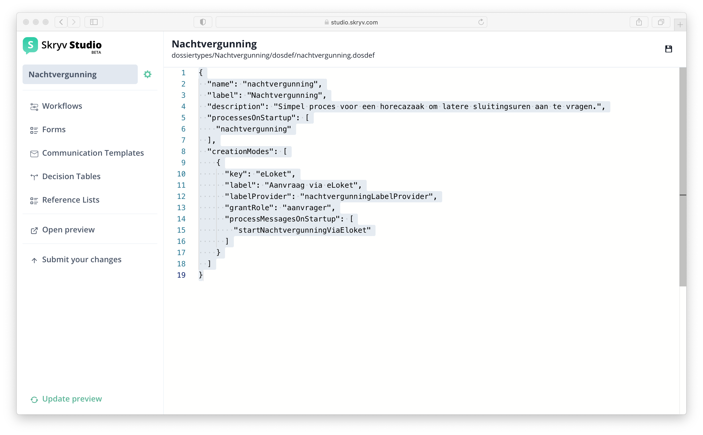

# Configuring Dossier Definitions

!> This documentation will be updated as soon as the editor for Dossier definitions is available in Skryv Studio

The overall properties of the Dossier type are defined in the following screen, accessible through the gear icon right to the dossier type name (in this case *Nachtvergunning*).

 These properties are modeled in a simple json file, which contains information such as the name and label of the dossier and other key elements in the overall set-up of the dossier type.
### Additional dossier configuration
Aside from defining which documents, processes & cases a dossier type can create, the dosdef-file also allows to add additional dossier-level configuration.

The following properties can be defined in the dossier definition json:

| Item                           | Explanation                                                                                                                                                                                                                                                                                                                      | Type            | Example                                                                                                                                                                                                                                                   | Mandatory? |
|--------------------------------|----------------------------------------------------------------------------------------------------------------------------------------------------------------------------------------------------------------------------------------------------------------------------------------------------------------------------------|-----------------|-----------------------------------------------------------------------------------------------------------------------------------------------------------------------------------------------------------------------------------------------------------|------------|
| name                           | Technical identifier                                                                                                                                                                                                                                                                                                             | string          | "dossier\_name"                                                                                                                                                                                                                                           | Yes        |
| label                          | Functional label                                                                                                                                                                                                                                                                                                                 | string          | "Name of the dossier"                                                                                                                                                                                                                                     | Yes        |
| processes                      | Processes (.bpmn files) that can be added manually in the dossier                                                                                                                                                                                                                                                                | list of strings | \["process\_1", "process\_2"\]                                                                                                                                                                                                                            | Yes\*      |
| cases                          | Cases (.cmmn files) that can be added manually in the dossier                                                                                                                                                                                                                                                                    | list of strings | \["case\_1", "case\_2"\]                                                                                                                                                                                                                                  |            |
| documents                      | Documents that can be added manually in the dossier                                                                                                                                                                                                                                                                              | list of strings | \["document\_1"\]                                                                                                                                                                                                                                         |            |
| processesOnStartup             | Processes that are started automatically when the dossier is started                                                                                                                                                                                                                                                             | list of strings | \["bulk\_print"\]                                                                                                                                                                                                                                         | Yes\*      |
| mailOnAssignment               | Send emails to the assignee of a newly assigned task. The template must contain the id of the template as defined in Mandrill.                                                                                                                                                                                                   |                 | {"enabled": true,   "template": "viaa-task-notification"}                                                                                                                                                                                              |            |
| defaultAssignee                | Set the default assignee for any kind of tasks                                                                                                                                                                                                                                                                                   |                 | {"enabled": false,   "assignee": "jimmy"}                                                                                                                                                                                                              |            |
| labelProvider                  | Define a label provider that automatically creates a dossier label. The java method name must be set.                                                                                                                                                                                                                            | string          | "nameOfTheLabelProvider"                                                                                                                                                                                                                                  |            |
| dossierCreationDefinitionKey   | Use a docdef in the dossier creation pop-up                                                                                                                                                                                                                                                                                      | string          | "document\_1"                                                                                                                                                                                                                                             |            |
| creationModes                  | In addition to the manual start-up mode, other start-up modes can be added with their own labelProvider, grantRole and message on start-up.                                                                                                                                                                                      |                 | {"key": "eLoket",   "label": "Aanvraag via eLoket",   "labelProvider": "eLoketLabelProvider",   "grantRole": "aanvrager",   "processMessagesOnStartup": \["eloket"\]}                                                                         |            |
| canBeDeactivatedWhenReady      | Automatically deactivates the dossier when there are no active processes in the dossier anymore                                                                                                                                                                                                                                  | boolean         | true                                                                                                                                                                                                                                                      |            |
| documentOrderInDossierOverview | Defines the order in which the documents are displayed in the "Documents" tab in the dossier overview                                                                                                                                                                                                                            | list of strings | \["document\_1", "document\_2"\]                                                                                                                                                                                                                          |            |
| dossierInfoSteps               | Steps that are going to be shown on the dossier info page  Note: the dossierInfoSteps defined in dosdef will overwrite steps added by customization                                                                                                                                                                        | list of objects | \[{ "title": "step 1", "description": "step 1 description" }, { "title": "step 2", "description": "step 2 description" }\]                                                                                                                                |            |
| dossierProgressSteps           | Steps that are going to be shown on the eloket dossier overview page  We look at the milestones currently present in the dossier and check them one by one (most recent first). If it matches one of the "relatedMilestoneKeys" in the steps, that step will be active. The progress bar will be 'red' up until that step. | list of objects | \[{   "name": "step 1",   "description": "step 1 description",   "relatedMilestoneKey": "key\_for\_step\_1"   }, {   "title": "step 2",   "description": "step 2 description",   "relatedMilestoneKey": "key\_for\_step\_2"   }\] |            |
| startButtonLabel               | Defines the dossier start button label                                                                                                                                                                                                                                                                                           | string          | "start new x dossier"                                                                                                                                                                                                                                     |            |

\*Mutually exclusive with other option