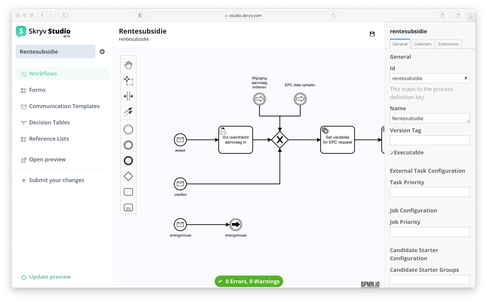

## BPMN, DMN (and some CMMN)

The workflows are mainly configured in BPMN. Business Decisions are modelled in DMN. CMMN is supported for ad-hoc tasks.

For more information about the BPMN elements supported, please consult the [BPMN 2.0 Implementation Reference](https://docs.camunda.org/manual/7.14/reference/bpmn20/).
For more information about DMN and the supported features, please consult the [DMN 1.3 Implementation Reference](https://docs.camunda.org/manual/7.14/reference/dmn/).
For more information about the CMMN elements supported, please consult the [CMMN 1.1 Implementation Reference](https://docs.camunda.org/manual/7.14/reference/cmmn11/).
## Configuring Tasks

BPMN support a number of tasks, such as user tasks and service tasks. 

To add a task to the workflow, execute the following steps in the workflow editor:

1. drag the task icon to the workspace and release it on the place you
2. Click the task
3. Click the wrench
4. Select task type (eg. user task)

When the task is selected, the right information pane will give you access to the available configuration parameters of the task
## User Task

User Tasks are tasks executed by users through the user interface.
The Skryv platform has out of the box support for various subtypes of user tasks.

| Task type                  | Front-Office | Back-Office | 
|----------------------------|--------------|-------------|
| Pop-up task (yes/no)       | coming       | supported   |
| Form task                  | supported    | supported   |
| Communication task         |              | supported   |
| Form with context task     |              | supported   |
| Bulk action tasks Select   |              | supported   |
| Bulk action tasks Download |              | supported   |

### Yes/No Task

A Yes-No task is very simple type of task that allows the user to check off an action.
Simply Create a process or a case and add a user task to the latter. Use Workflow modeler to edit the workflow.

### Form Task

A form task allows the user to enter and view  information inside a structured page. 

#### Instructions for configuration

1. Create a Form in the form editor
2. Create a process with a user task
3. Link the docdef to the user task:
   1. Select the task, this will show the details pane on the right
   2. Under `Element Template`, select Skryvdoc
   3. Add the id of the form as `Document Type`

?> There are a number of optional steps in the configuration

4. Choose the scope of the communication
   1. `Dossier` will link the form to the dossier, there can only be 1 form of this type in the entire dossier
   2. `Process` will link it to the process, so if the process is run multiple times inside the dossier (eg. monthly repeat) the form will be initialised for each process instance
   3. `Task` will link it to the task itself, so each time the task is executed, a new instance will be created.
5. Choose wether the form should become read-only after submitting
6. Choose wether the form should be valid before the task can be submitted (it is always possible to do intermediate saves)
7. Choose a custom Submit Button Label to shown on the button that completes the task.
8. Define the variable where you want to store the content of the form for later reuse

### Communication Task

A communication tasks allows the user to create a communication that will later be sent (e.g. via e-mail, eBox, ...) or printed.

#### Instructions for configuration

1. Create a new communication template in the [Communication Template Editor](/advanced_config/templates.md)
2. Create a process with a user task
3. Link the user task to the template:
   1. Select the task, this will show the details pane on the right
   2. Under `Element Template`, select SkryvCommunication
   3. Add the id of the template as `Template Name`

?> There are a number of optional steps in the configuration

4. Choose the scope of the communication
   1. `Dossier` will link the communication to the dossier, there can only be 1 communication of this type in the entire dossier
   2. `Process` will link it to the process, so if the process is run multiple times inside the dossier (eg. monthly repeat) the template will be initialised for each process instance
   3. `Task` will link it to the task itself, so each time the task is executed, a new instance will be created.
5. Choose wether the communication should be shown in read-only modus (eg. for printing)
6. Choose a custom Submit Button Label to shown on the button that completes the task.

### More complex task types

Besides the tasks described above, we also support Form Task with Context, Form Task with Context and Subdocs and Bulk Tasks.
For these more advanced configurations, please contact [one of our consultants](mailto:support@skryv.com) to give you an introduction.

### Ad-hoc tasks

CMMN support allows you to add ad-hoc tasks that depend on the 
For more information about the CMMN tasks, please contact [one of our consultants](mailto:support@skryv.com) to give you an introduction.
### Other configuration options for user tasks

#### Assignee

#### Candidate Users and Candidate Groups
Assign the task to a specific person or a group, identified by their id

?> Try to avoid using personal assignment, rather work with a group and add the relevant people to the group through the admin pages of the application.

#### Due Date & Follow-up Data
When a task is due or requires follow-up, this is used in the task list and task visualisation.
These

#### Asynchronous Continuations

## Decision Task

Decision tables (following the DMN standard) can be integrated into BPMN workflows to apply business rules.

### Instructions for configuration

1. Create a DMN through the Decision Tables Modeler
2. Create a Business Rules Task in the BPMN workflos
3. Link BPMN task to DMN
   1. With the Business Rules task selected, go to the `General` tab of the information pane
   2. Under implementation, select DMN & enter the Id of your DMN file.
   3. List the input variable for the decision: in the Input/Output tab of the task, under Input Parameters, enter the input variable(s) to be used in the decision table. Define the values of each variable according to where this data is extracted from (i.e. field from docdef, BPMN variable…). Pay attention that all information is available before executing the decision.
   4. Add rules to the DMN: Fill in the Input and Outputs variables for the decision in the Decision Table tab, making sure to specify the correct format of each variable
   5. Add DMN output to the BPMN task: In the General tab, under Result Variable, enter the name of the DMN output variable. 

## Service Tasks

Service tasks allow to delegate specific functionality to pieces of code. 
The Skryv platform comes with a set of such predefined functionality (e.g. send a mail, send an update to Dosis, collect information from Magda, ...)

Through customisation of the app, new functionality can be added as well. please contact [one of our consultants](mailto:support@skryv.com) to give you an introduction. 

## Expression Language (EL)

EL expressions can be used in many circumstances to evaluate small script-like expressions. 
As such, it allows to add more dynamic logic to the workflow, eg. to add a calculated due date, to calculate conditions etc.

A simple example is `${4 > 3}`:
* The `${ ... }` indicates this is an expression
* The expression itself `4 > 3`  will be executed
* The result will be `true`, which can be used in e.g. gateways.

A more useful example could be `${process-var == 'start'}`. This expression checks if a variable on the process called `process-var` is a `string` with the value `start`.
The **Fluent API** gives you access to a whole bunch of functionality that can be used in such expressions.  

The Unified Expression Language (EL) is specified as part of the JSP 2.1 standard ([JSR-245](https://jcp.org/aboutJava/communityprocess/final/jsr245/index.html)). 
The [JUEL](http://juel.sourceforge.net/) implementation backs the execution. 
To get more general information about the usage of Expression Language, please read the [official documentation](http://docs.oracle.com/javaee/5/tutorial/doc/bnahq.html). Especially the [provided examples](http://docs.oracle.com/javaee/5/tutorial/doc/bnahq.html#bnain) give a good overview of the syntax of expressions.
## Fluent API

Extending the EL expressions with Skryv specific support is realised through the Fluent API.

The Fluent API allows to interact with other configuration artefacts from a Camunda process. Examples when you want to use the fluent API is for example when you want to fetch the information a user filled in in the request to decide which path in the process you will follow.

The Fluent API is typically used in Camunda listeners or service tasks, to retrieve specific data from dossiers or to trigger specific operations on specific arterfacts from the Camunda process.

The base principle of the Fluent API is that you can chain one operation after the other, passing the output of the operation on the left to the next one. 

A simple example to explain this principle is `${skryv.dossierFromScope(execution).getLabel()}`. This executes the following logic:
* creates the context of Skryv
* fetches the dossier
* returns the label

The following sections contain the reference documentation for the Fluent API.

### Accessing a dossier

The most common need is to get full access to the current dossier:

`${skryv.dossierFromScope(execution)}`

Alternatively, a specific dossier can be retrieved based on its id, i.e. the business key:

`${skryv.dossier(dossierId)}`

### Operations on a dossier

#### Dossier label

To get the human readable dossier label:

`${skryv.dossierFromScope(execution).getLabel()}`

?> It is a best practice to store the dossier label in a Camunda variable `dossierLabel`. This makes it possible to retrieve dossiers in the Camunda cockpit based on the dossier id.

`${execution.setVariable('dossierLabel', skryv.dossierFromScope(execution).getLabel())}`

The dossier label can also be recalculated from the Camunda process, based on a specific label provider or not:

`${skryv.dossierFromScope(execution).recalculateLabel(labelProviderName)}`

`${skryv.dossierFromScope(execution).recalculateLabel()}`

?> It is a best practice to set the Camunda variable `dossierLabel` again whenever the dossier label is recalculated.

For more information on label providers, please refer to the article “[How to set up a label provider?](https://skryvdev.atlassian.net/wiki/spaces/SP/pages/1560543242)”.

#### Dossier export

`${skryv.dossierFromScope(execution).exportDossierWithAttachments(folderName)}`

`${skryv.dossierFromScope(execution).exportSkryvDossier(folderName)}`

#### Dossier access

`${skryv.dossierFromScope(execution).grantAccess().forTeamOfUser(userSub)}`

`${skryv.dossierFromScope(execution).revokeAccess().forTeamOfUser(userSub)}`

#### Other dossier operations

`${skryv.dossierFromScope(execution).takeSnapshot(snapshotLabel)}`

`${skryv.dossierFromScope(execution).deactivate()}`

### Accessing a document

The most commonly used way to get access to a document on the current dossier is by using the getOrCreate method, which will create or - if it exists already - return the dossier scoped document for a specific definitionKey, i.e. docdef:

`${skryv.dossierFromScope(execution).getOrCreateDocumentByDefinitionKey(definitionKey)}`

Self-explanatory alternatives to retrieve a document are:

`${skryv.dossierFromScope(execution).getDocumentByDefinitionKey(definitionKey)}`

`${skryv.dossierFromScope(execution).findDocumentByDefinitionKey(definitionKey)}`

Accessing process scoped documents can be done as follows:

`${skryv.execution(execution)..getOrCreateDocumentByDefinitionKey(definitionKey)}`

### Operations on a document

`getField(String fieldPath)`

`setField(String fieldPath, Object value)`

`markReadOnly()`

`markEditable()`

`reset()`

`isValid()`

`getDocument()`

`getRawDocumentValue()`

`getRawDocumentValueAs(Class<T> classOfT)`

`updateFromWorksheet(Map<String, Object> worksheetData)`

`updateFromVariableScope(VariableScope scope)`

`updateWithMapping(T input, MutableSkryvDocMapper<T> mapper)`

`clearAndUpdateWithMapping(T input, MutableSkryvDocMapper<T> mapper)`

### Accessing a process - delegateExecution

`skryv.execution(execution)`

### Accessing a communication

`skryv.communication(communicationId)`