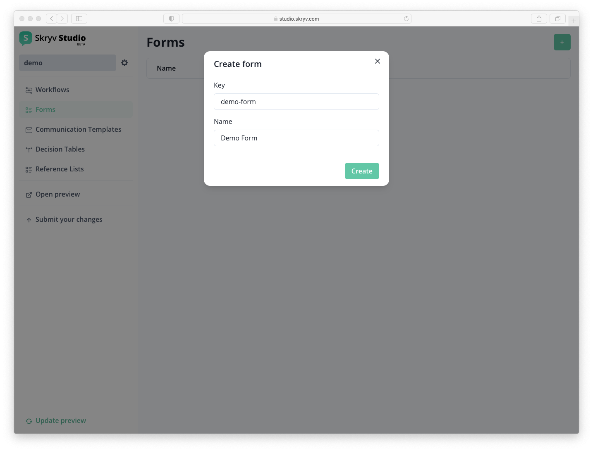
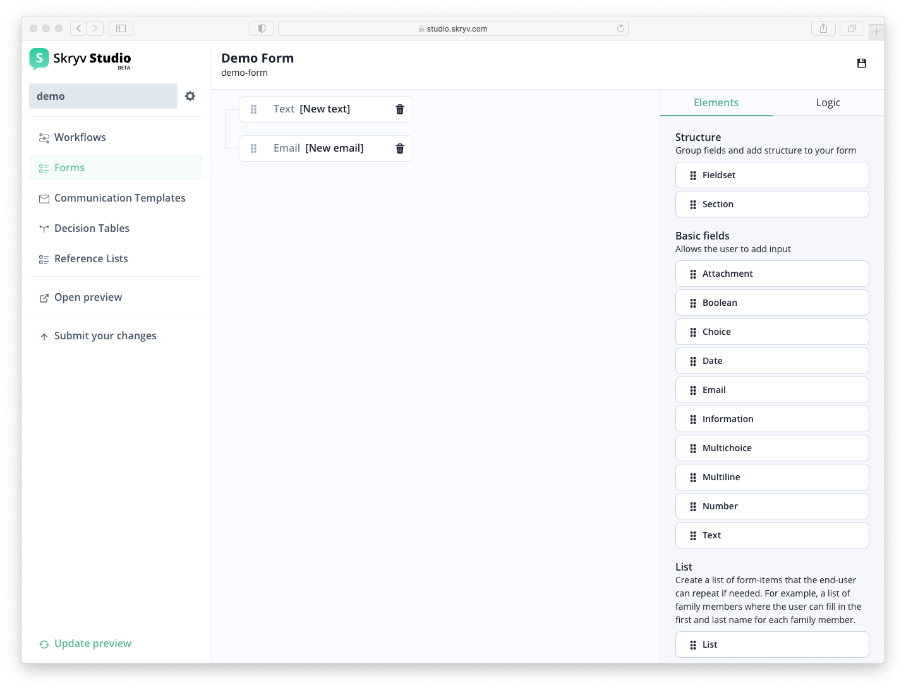

# Setting up your 1st form

To add a form to your configuration, select `Forms` in the menu left and click the `+` button.

This will bring you to the form modeler, which supports an extensive range of content types, validations and other behaviour.

Simply drag the fields and structural elements into the working zone, the blue area will indicate where the item will end up.

To add more detailed information, click on one of the items to take you to the details.

Once the form is ready, click the save button!