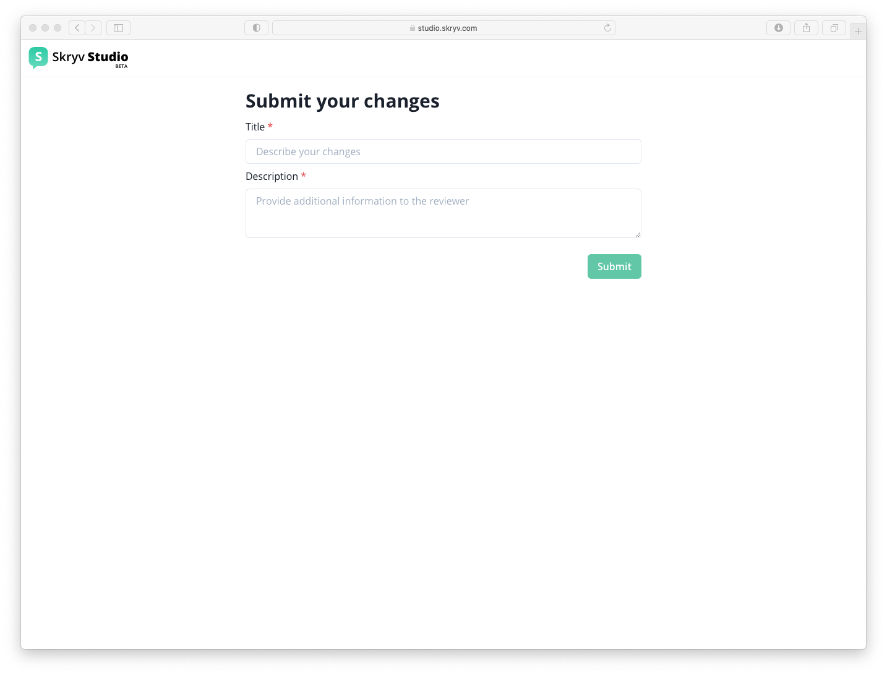
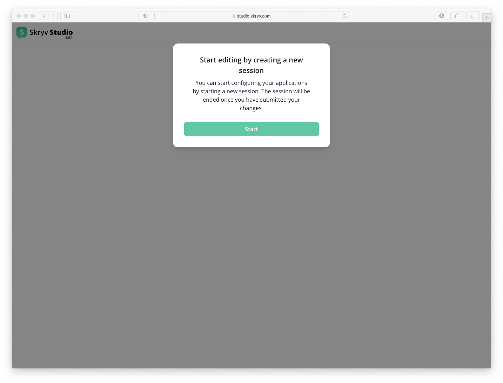

# Publishing your 1st version

Once you are happy with the changes you made, you can submit the changes.

This will trigger the quality assurance flow (including review and possibly testing of your configuration)

During this quality assurance flow, you will not see your changes anymore, once approved they become the new reality :)

