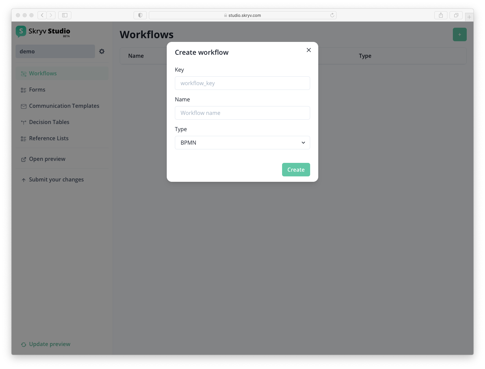
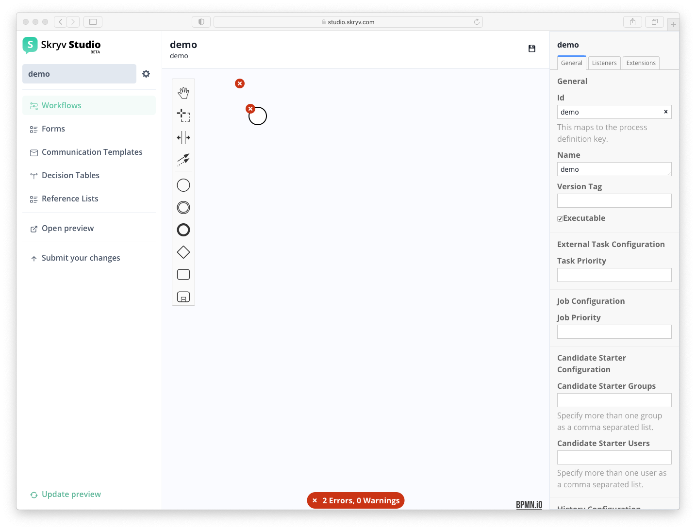
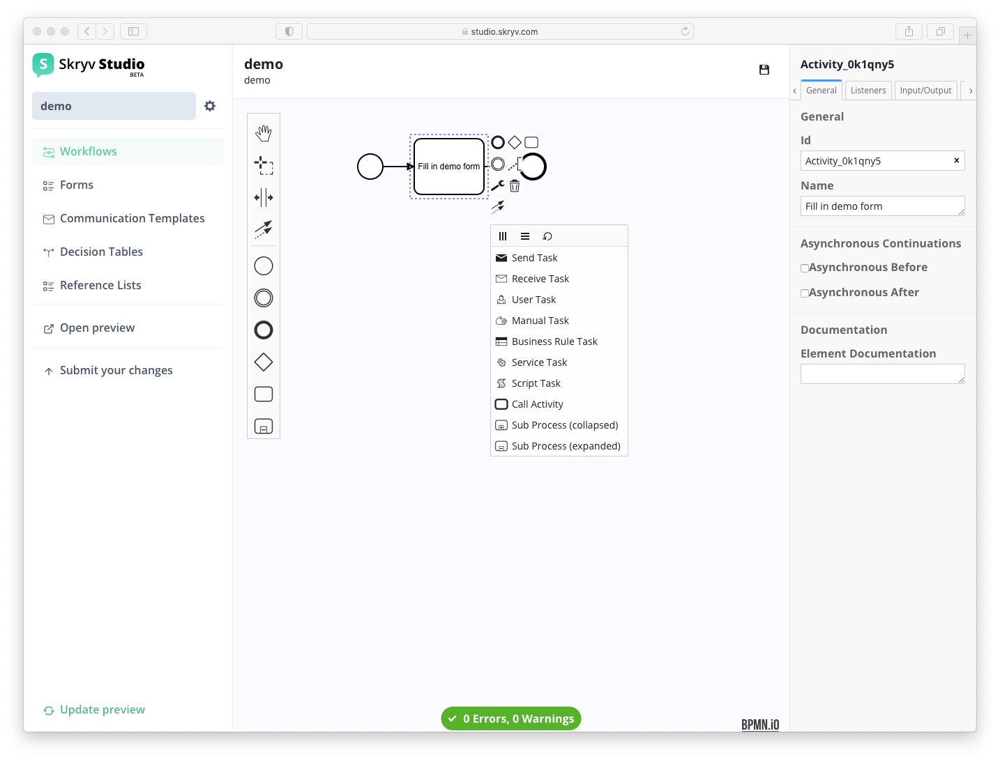
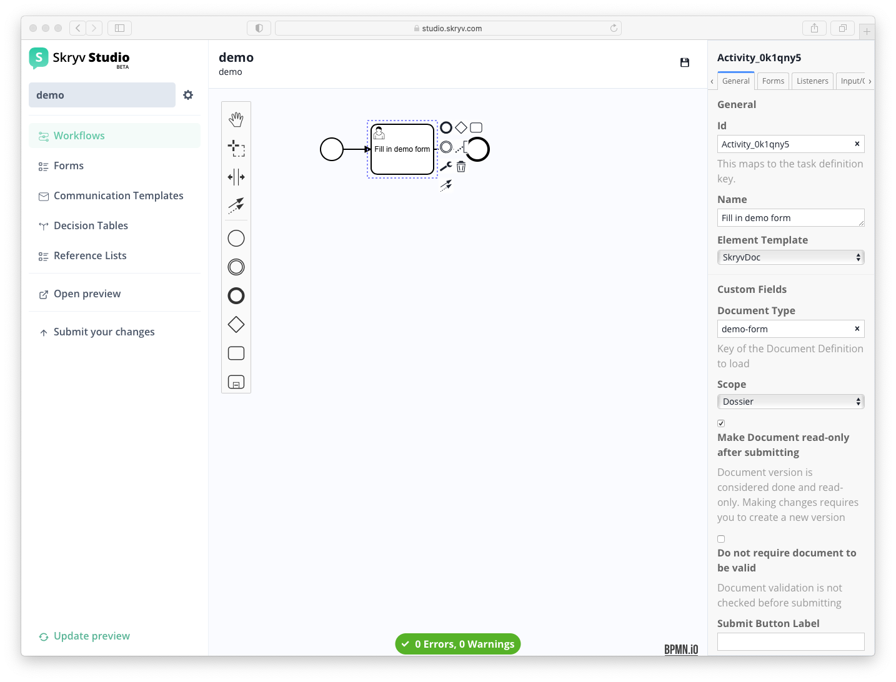

# Setting up your 1st workflow

To add a workflow to your configuration, select `Workflows` in the menu left and click the `+` button.

This will bring you to the workflow modeler, which supports an extensive set of BPMN elements.

As you start and as you continue, you will get indications of wether the BPMN is valid or not. Use the items on the left to create your workflow, for example the one shown below.
Use the wrench item to select the properties of the BPMN element. For a task that you want to link to a form, the task type needs to be `User Task`.

Once you created this `User Task`, you can select an element template (right of the screen) and set this to `SkryvDoc`.

With this done (and the save button clicked), you have a workflow with a task that is linked to the form!
