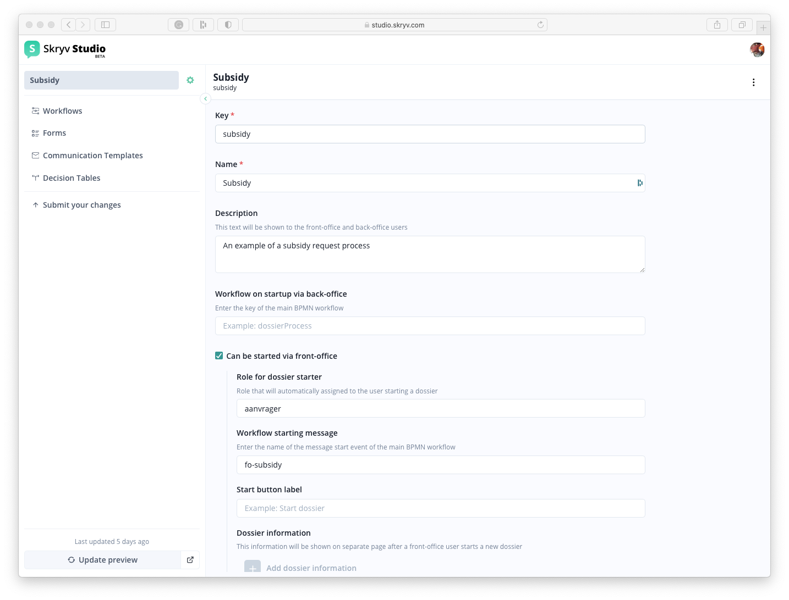
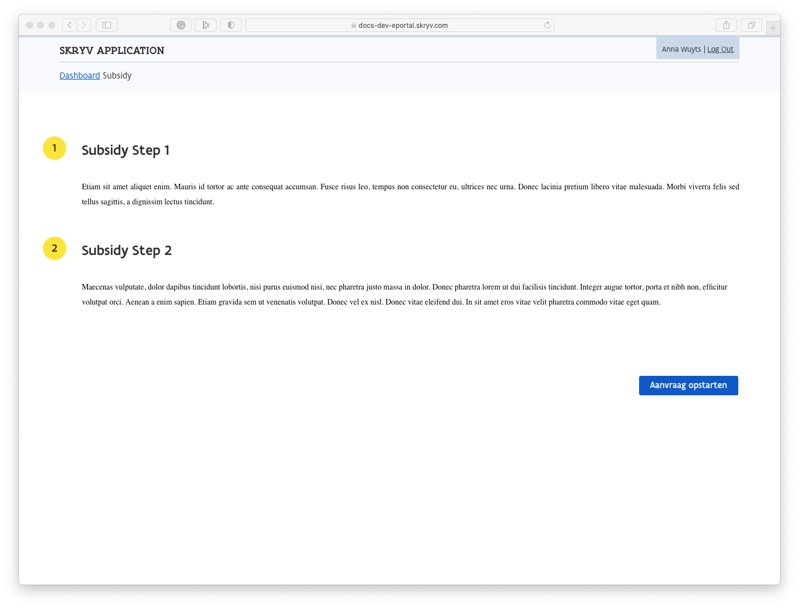
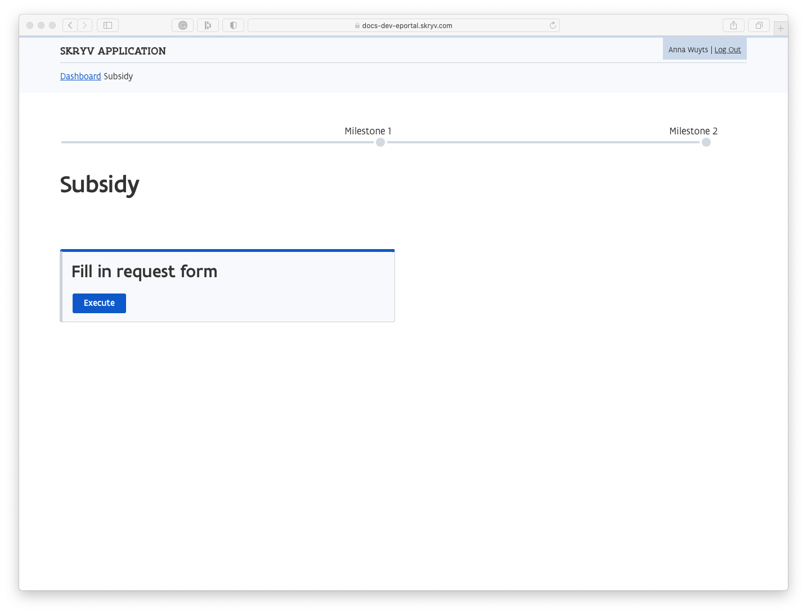

# Configuring Dossier Type Behaviour

The overall properties of the Dossier type are defined in the following screen, accessible through the gear icon right to the dossier type name (in this case *Subsidy*).

## Dossier Type Properties
Through this screen, you can add various dossier-level configuration parameters.

| Item                                | Explanation                                                                                                                                                                                                                                                                                                                      | Type            | Example                                                                   | Mandatory? |
|-------------------------------------|----------------------------------------------------------------------------------------------------------------------------------------------------------------------------------------------------------------------------------------------------------------------------------------------------------------------------------|-----------------|---------------------------------------------------------------------------|------------|
| Key                                 | Technical identifier                                                                                                                                                                                                                                                                                                             | string          | "dossier\_name"                                                           | Yes        |
| Name                                | Functional label                                                                                                                                                                                                                                                                                                                 | string          | "Name of the dossier"                                                     | Yes        |
| Description                         | Description of the dossier type                                                                                                                                                                                                                                                                                                  | string          | "Description of the dossier, which can be somewhat longer than the name." |            |
| Workflow on startup via back-office | BPMN Proces that is started automatically when the dossier is started in the back-office                                                                                                                                                                                                                                         | list of strings | \["bulk\_print"\]                                                         |            |
| Can be started via front-office     | Adds the dossier type to the front-office application                                                                                                                                                                                                                                                                            |                 |                                                                           |            |
| Role for dossier starter            | Role that will automatically assigned to the user starting a dossier                                                                                                                                                                                                                                                             | strinbg         | "requestor"                                                               |            |
| Workflow starting message           | The convention is that the front-office starts a workflow through a BPMN message. Enter the name of the message start event of the main BPMN workflow                                                                                                                                                                            | string          | "front-office"                                                            |            |
| Start Button Label                  | Defines the dossier start button label                                                                                                                                                                                                                                                                                           | string          | "start new x dossier"                                                     |            |
| Dossier information                 | Defines if there is a custom dossier info page available. In case it is set to true, the user will be redirected to the dossier info page instead of being redirected to the first task. This page contains the high-level steps that will be executed so the user knows what to expect.                                         |                 |                                                                           |            |
| Dossier progress                    | Steps that are going to be shown on the eloket dossier overview page  We look at the milestones currently present in the dossier and check them one by one (most recent first). If it matches one of the related milestone keys in the steps, that step will be active. The progress bar will be 'red' up until that step. |                 |                                                                           |            |
| Dossier Label Format Type           | Define a label provider that automatically creates a dossier label, taking into account a combination of a counter, year prefix, label, ... Different labels can be used in the front- and back-office                                                                                                                           |                 |                                                                           |            |

#### Dossier Information
Dossier information can be shown to the user when the dossier is created. This typically covers a number of steps the dossier will go through, in order to give the user an understanding of what to expect before starting the request.

#### Dossier Progress
With Dossier progress, the user can follow the advancement of the dossier throughout its lifecycle. 
The steps defined in the dossier configuration are matched with the milestones reached in the process. 

## Advanced Dossier Type Properties
Some less used or more advanced options can be added through the underlying JSON configuration file (/!\ Only change this if you know what you are doing)

| Item                           | Explanation                                                                                                                                 | Type            | Example                                                                                                                                                                           | Mandatory? |
|--------------------------------|---------------------------------------------------------------------------------------------------------------------------------------------|-----------------|-----------------------------------------------------------------------------------------------------------------------------------------------------------------------------------|------------|
| mailOnAssignment               | Send emails to the assignee of a newly assigned task. The template must contain the id of the template as defined in Mandrill.              |                 | {"enabled": true,   "template": "viaa-task-notification"}                                                                                                                      |            |
| canBeDeactivatedWhenReady      | Automatically deactivates the dossier when there are no active processes in the dossier anymore                                             | boolean         | true                                                                                                                                                                              |            |
| defaultAssignee                | Set the default assignee for any kind of tasks                                                                                              |                 | {"enabled": false,   "assignee": "jimmy"}                                                                                                                                      |            |
| creationModes                  | In addition to the manual start-up mode, other start-up modes can be added with their own labelProvider, grantRole and message on start-up. |                 | {"key": "eLoket",   "label": "Aanvraag via eLoket",   "labelProvider": "eLoketLabelProvider",   "grantRole": "aanvrager",   "processMessagesOnStartup": \["eloket"\]} |            |
| dossierCreationDefinitionKey   | Use a docdef in the dossier creation pop-up                                                                                                 | string          | "document\_1"                                                                                                                                                                     |            |
| documentOrderInDossierOverview | Defines the order in which the documents are displayed in the "Documents" tab in the dossier overview                                       | list of strings | \["document\_1", "document\_2"\]                                                                                                                                                  |            |
