# Configuring Forms (and the corresponding information model)

With the form modeler, you can configure forms that, when linked to a user task in the workflow, can be filled in by a user.
Forms can be viewed in a webpage, but are also available to be downloaded with a default PDF visualisation.
Additionally, an API (REST) and export (CSV) can be made available as well. Finally, this configuration will automatically propagate to the search index for easy search & reporting in a later stage.

The form structure can be created by dragging & dropping the relevant fields (basic or advanced) structuring elements or lists into the form.


For each of these elements, properties are available when you click on it.


Behind the scences, this is translated into a json file that describes the information model of the form, which can be accessed in the raw format.

!> This raw format is for power users only and no backward compatibility guarantees are given.


## Basic Fields

A collection of field types is currently supported, listed below.

### Attachment

When you expect the user to upload an attachment.


The allowed formats are defined in the `application.properties` file of the applications. For example: `skryv.attachments.allowed-mime-types=application/pdf`

### Boolean

A yes/no field that can be shown in various ways.

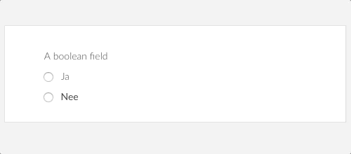

### Choice & Multichoice

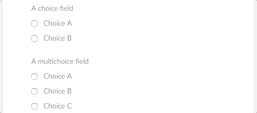

#### Options

Options define what a user can choose in a choice or mulitchoice field

### Date

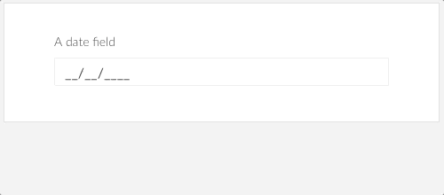

### Email

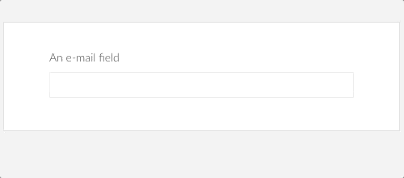

### Information

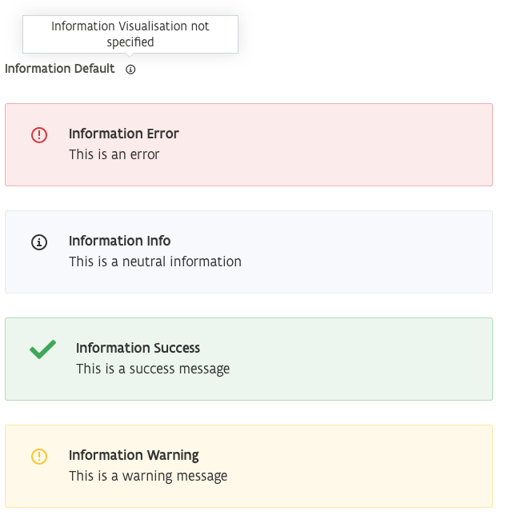

### Multiline

Similar to a text field but allows for several lines of text

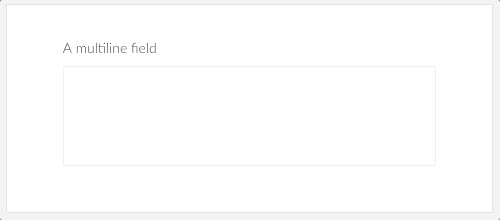

### Number

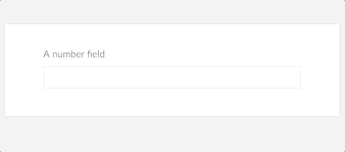

### Text

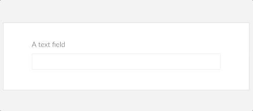

#### Masks

Text fields can be assigned a mask. A mask will enforce a format (e.g. enforcing the format of a social security insurance number).

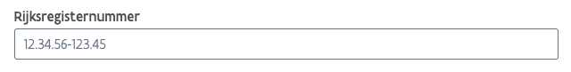

Currently supported masks are `ssin` (social security insurance number), `iban` (bank account), `BTW number` (VAT number) and `KBO number` (Company identification)

## Adding Structure to your Forms

### Fieldset

Fieldsets allow to group fields that logically belong together.

2 visualisation options are available, the default and the `box` visualisation

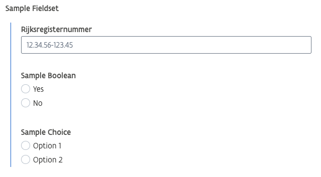

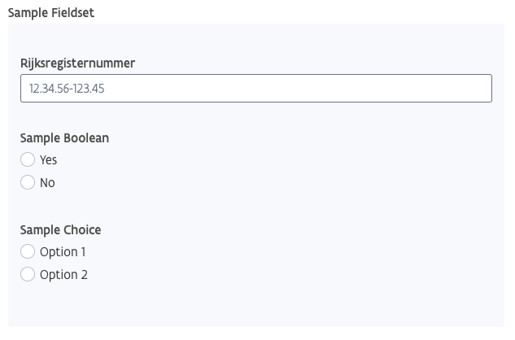

### Section

A section allows splitting your form in multiple parts, giving easier navigation and overview.

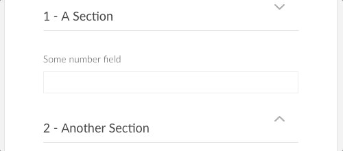

!> _important:_ a section is never part of a field’s path within the expression

## Adding Lists to your Forms

If you want to repeat certain parts of the form, use lists.

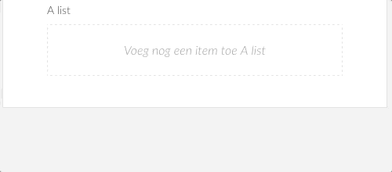

## Advanced Fields

Advanced fields are predefined combinations of basic fields, structuring elements, lists and/or validations. Just like the other elements, simply drag and drop these elements in the form to use them.

!> You still want to update the key of these fields for clarity and future (e.g. templates)

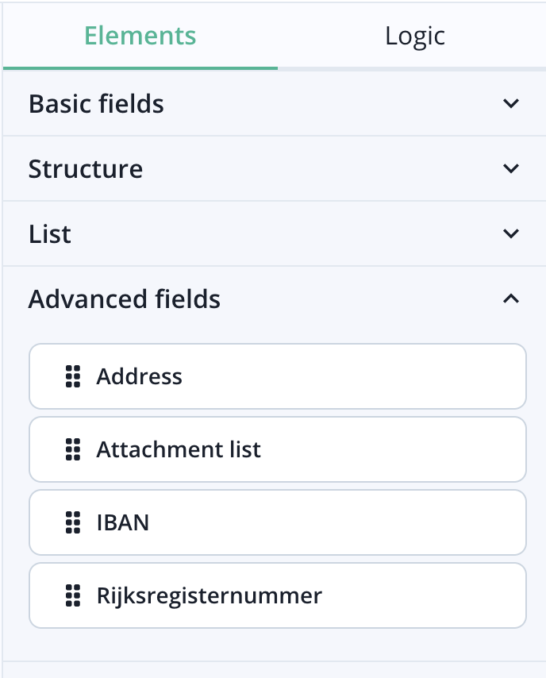

## Reference Properties

!> Only to be used in JSON, advanced configuration

| **Field type**   | **Available properties**                                                                                                              |
| ---------------- | ------------------------------------------------------------------------------------------------------------------------------------- |
| text             | `onlyWhen`, `conditions` , `read-only`, `required` ,`default`, `computedDefault`, `help`, `helpInLine` , `computedWith`, `maskConfig` |
| number           | `onlyWhen`, `conditions` , `read-only`, `required` ,`default`, `computedDefault`, `help`, `helpInLine` , `computedWith`,              |
| boolean          | `onlyWhen`, `conditions` , `read-only`, `required` , `default`, `computedDefault`, `help`, `helpInLine`                               |
| multiline        | `onlyWhen`, `conditions` , `read-only`, `required` , `help`, `helpInLine`                                                             |
| date             | `onlyWhen`, `conditions` , `read-only`, `required` ,`default`, `computedDefault`, `help`, `helpInLine`                                |
| information      | `onlyWhen`, `help`, `helpInLine`                                                                                                      |
| list             | `onlyWhen`, `conditions` , `read-only`, `required` ,`visualisation`, `initialLength`, `labelForAdd`, `labelForDelete`                 |
| attachment2      | `onlyWhen` , `required`                                                                                                               |
| choice           | `onlyWhen` , `read-only`, `required` ,`default`, `computedDefault`, `help`, `helpInLine` , `computedWith`, `displayOptions`           |
| multichoice      | `onlyWhen` , `read-only`, `required` ,`default`, `computedDefault`, `help`, `helpInLine` , `computedWith`, `displayOptions`           |
| option           | `onlyWhen`                                                                                                                            |
| email            | `onlyWhen` , `read-only`, `required` ,`default`, `computedDefault`, `help`, `helpInLine` , `computedWith`, `inputsize`                |
| section          | `conditions`, `help`, `helpInLine`, `isOpenByDefault`                                                                                 |
| fieldset         | `onlyWhen`, `conditions` , `read-only` , `help`, `helpInLine`                                                                         |
| address fieldset | `onlyWhen` , `conditions` , `read-only` , `required`,`customComponentName`,`autocomplete`, `visualisation`                            |
| object           |                                                                                                                                       |

## Properties

Standard & advanced properties exist for each field type or structuring element.
These properties are available when you select the field in the form structure.
Properties indicated with a \* are not (yet available in Skryv Studio).

### Standard Properties

| **Property**  | **Explanation**                                                                                                                           |
| ------------- | ----------------------------------------------------------------------------------------------------------------------------------------- |
| Type          | Type of field<br><br>→ obligatory                                                                                                         |
| Name          | Display name of the field shown on the actual form<br><br>→ obligatory                                                                    |
| Key           | Technical name (key) of the field to be referenced during configuration<br><br>→ obligatory                                               |
| Only When     | Define when this field is being shown<br><br>Note: choice or multichoice options that are “not shown” are actually visualised as disabled |
| Required      | The field needs to be filled in before you can submit the task                                                                            |
| Read-only     | The value of the field can not be modified                                                                                                |
| Computed with | The value of this field is computed with a computedExpression                                                                             |
| Default value | A default value of the field                                                                                                              |

### Advanced Properties

| **Property**                                   | **Explanation**                                                                            |
| ---------------------------------------------- | ------------------------------------------------------------------------------------------ |
| Visualisation                                  | For some field types we support different visualisations                                   |
| Help                                           | Help text for the user                                                                     |
| - Always Visible                               | Should the help text be hidden after a “?” or can it be shown by default                   |
| Mask                                           | Show the value of the field in the following structure                                     |
| Conditions                                     | By adding a condition you can give a warning or error notification to the user.            |
| Is Open By Default                             | Only used with sections. When you start the form, is the section collapsed or uncollapsed. |
| Initial Length                                 | How many items are there in a list field at the start                                      |
| Text on button to add an item to the list      | The label that should be used on the button to add a new item to the list                  |
| Text on button to delete an item from the list | The label that should be used on the button to remove an item from a list                  |

### Properties not yet available in Skryv Studio

| **Property**          | **Explanation**                                                                                             | **Available values**                                           | **Example value**                             |
| --------------------- | ----------------------------------------------------------------------------------------------------------- | -------------------------------------------------------------- | --------------------------------------------- |
| resolvedReferencelist |                                                                                                             |                                                                |                                               |
| autocomplete          | Used with an address fieldset in the front-office. Based on the search the address fields are autocompleted | `true`, `false`                                                | `“autocomplete“: true`                        |
| customComponentName   |                                                                                                             | `skrAddressInput` , `skrHiddenComponent`, `skrAttachmentsList` | `"customComponentName": "skrHiddenComponent"` |

## Computed expressions

Computed expressions allow to add logic to the information model, such as adding conditions to a field (assessing the validity) or only showing certain fields depending on the value of another field.


Computed expressions are small scripts (javascript), which can be added under the `Logic` tab of the form definition or in the `conditions` property of fields.


### Building expressions

The expressions are small snippets of javascript and return a boolean (true/false) or a snippet of calculated data.

A very simple example of an expression is `false`, returning false no matter what. If this expression is added (in the `Logic` tab), it can be used in e.g. an `Only when` property of a field. Because the expression always returns `false`, the field will never be shown.

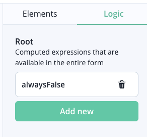

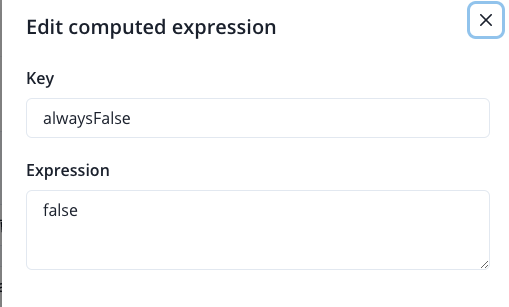

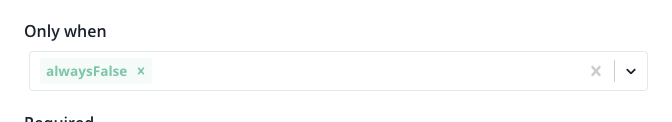

If we want to use data from the form or from the dossier in this expression, we can do so.

`$` refers to the current context (the active field in a `condition`, the form in the `logic` tab)

`$.fieldkey` refers to a field in the form with key `fieldkey`

`$.fieldset.fieldkey` refers to a field with key `fieldkey` in a fieldset with key `fieldset`

An example of this is the computed expression `$.sampleFieldset.sampleBoolean`, which takes the selected value in the boolean field `sampleBoolean` in the section `sampleFieldset`. If we use this expression in the `Only when` property of another field, this will only show when the user selects `true` in the boolean.

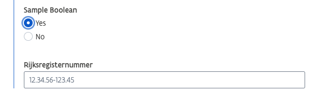

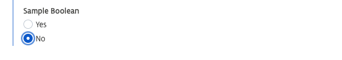

This can be extended to other field types, such as `Number`, like so: `$.sampleFieldset.sampleNumber === 10`.

> Please refer to [Javascript Comparisons](https://www.w3schools.com/js/js_comparisons.asp) for more information about building these comparisons.

The `Only when` property of fields expexts an expression to return `true` or `false`. Other properties, such as the `Computed Default` expect a value. This expression can be as simple as `10` (always returning 10) or a richer expression based on other fields such as `$.sampleFieldset.sampleNumber * 2` (returning the double of the value of `sampleNumber` in the `sampleFieldset`).

If we want to make this expressions even richer, we can use `if-then-else` statements:
`
If <a condition> is true
? Then <something>
: Else <something else>
`

> Please refer to [Javascript If Then Else](https://www.w3schools.com/js/js_if_else.asp) if you are not familiar with if-then-else

A handy short syntax for and if-then-else statement is: `A === B ? true : false`

An example is the calculation of a subsidy based on the selected type of subsidy
`$.typeSubsidie.selectedOption === ‘subsidieA’ ? $.gevraagdBedrag*0.5 : $.gevraagdBedrag*0.75`

### Reference expressions

> You can copy-paste these expressions in the **field conditions**

| **What**                                               | **Computed expression**                                                                                                                                                                                                 |
| ------------------------------------------------------ | ----------------------------------------------------------------------------------------------------------------------------------------------------------------------------------------------------------------------- |
| To check if the postcode of the address is in Flanders | `"typeof $ === 'string' ? (1500 <= Number($) && Number($) <= 3999) \| (8000 <= Number($) && Number($) <= 9999) : true"`                                                                                                 |
| To check the IBAN number                               | `“typeof $ === 'string' && $.length > 0? ($.substring(0,2) === 'BE' ? ((($.substring(4,16) + '1114') % 97 + $.substring(2,4)) % 97 === 1) : ((($.substring(2,14) + '1114') % 97 + $.substring(0,2)) % 97 === 1)):true”` |
| To check the KBO                                       | `"typeof $ === 'string' && $.length > 0 ? (97 - $.substring(0,8) % 97) === Number($.substring(8)) : true”`                                                                                                              |
| To check the validity of a national registry number    | `"typeof $=== 'string' && $.length > 0 ? (97 - ($.substring(0,9) % 97) - $.substring(9,11) === 0) || (97 - ((2 + $.substring(0,9)) % 97) - $.substring(9,11) === 0) : true"`                                                                                                                  |

### Examples of computed expressions to add logic:

| **What**                                                    | **Computed expression**                                                                                     |
| ----------------------------------------------------------- | ----------------------------------------------------------------------------------------------------------- |
| Based on the option one selected in a choice field          | `"$.path_to_choice_field !== undefined? $.path_to_choice_field.selectedOption === 'selected_value': false"` |
| Calculate with dates                                        | Use `moment()`                                                                                              |
| To check if we are in a specific task with `id_of_the_task` | `"currentTask.taskDefinitionKey === 'id_of_the_task'"`                                                      |

### Examples of computed expressions on a list:

| **What**                          | **Computed expression**                                                                                   |
| --------------------------------- | --------------------------------------------------------------------------------------------------------- |
| Check if there is at least 1 item | `$.listKey.length >= 1`                                                                                   |
| listItemTitle                     | `"$.field1.selectedOption === undefined ? 'Field1' : $.field1.selectedOption + ' ' + ($.field2 \| '')"}}` |
| onlyWhen                          | `"fieldSelectedOption": "$.field.selectedOption === 'option1'"}}`                                         |

## Address custom component

An address fieldset can use the custom behaviour of the custom component `skrAddressInput` if it contains the following fields:

- Street
- House number
- Box number
- Zip code
- \[OPT\] NIS code
- Municipality
- \[OPT\] Country

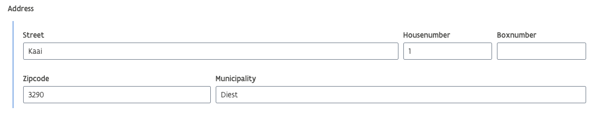

Example:

```json
{
  "type": "fieldset",
  "label": "Address",
  "name": "address",
  "customComponentName": "skrAddressInput",
  "autocomplete": true,
  "fields": [
    {
      "type": "text",
      "label": "Street",
      "name": "street"
    },
    {
      "type": "text",
      "label": "Housenumber",
      "name": "housenumber"
    },
    {
      "type": "text",
      "label": "Boxnumber",
      "name": "boxnumber"
    },
    {
      "type": "text",
      "label": "Zipcode",
      "name": "zipcode"
    },
    {
      "type": "text",
      "label": "Municipality",
      "name": "municipality"
    }
  ]
}
```

For more information about these advanced configurations, please contact [one of our consultants](mailto:support@skryv.com) to give you an introduction.
