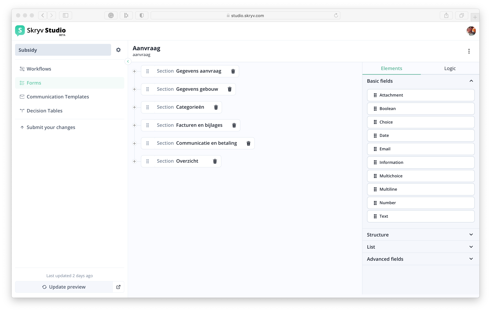

# Configuring Forms (and the corresponding information model)

With the form modeler, you can configure forms that can in turn be used in the workflows. Beside the form visualisation a default PDF visualisation is available as well.
On top of the visualisations, an API (REST) and export (CSV) can be made available as well. Finally, this configuration will automatically propagate to the search index for easy search & reporting in a later stage.

The form structure can be created by dragging & dropping the relevant fields into the structure.

For each of the structural elements or fields, properties are available when you click on the individual field.

Behind the scences, this is translated into a json file that describes the information model of the form, which can be accessed in the raw format.

!> This raw format is for power users only and no backward compatibility guarantees are given.

## Field types

| **Field type**   | **Explanation**                                                                                                                                                                                                        | **Available properties**                                                                                                              |
|------------------|------------------------------------------------------------------------------------------------------------------------------------------------------------------------------------------------------------------------|---------------------------------------------------------------------------------------------------------------------------------------|
| text             | \-                                                                                                                                                                                                                     | `onlyWhen`, `conditions` , `read-only`, `required` ,`default`, `computedDefault`, `help`, `helpInLine` , `computedWith`, `maskConfig` |
| number           | \-                                                                                                                                                                                                                     | `onlyWhen`, `conditions` , `read-only`, `required` ,`default`, `computedDefault`, `help`, `helpInLine` , `computedWith`,              |
| boolean          | A yes/no field                                                                                                                                                                                                         | `onlyWhen`, `conditions` , `read-only`, `required` , `default`, `computedDefault`, `help`, `helpInLine`                               |
| multiline        | Similar to a text field but allows for several lines of text                                                                                                                                                           | `onlyWhen`, `conditions` , `read-only`, `required` , `help`, `helpInLine`                                                             |
| date             | \-                                                                                                                                                                                                                     | `onlyWhen`, `conditions` , `read-only`, `required` ,`default`, `computedDefault`, `help`, `helpInLine`                                |
| information      | When you want to give extra information to the user without expecting an answer in return                                                                                                                              | `onlyWhen`, `help`, `helpInLine`                                                                                                      |
| list             | A list to which users can dynamically add/remove a set of fields.                                                                                                                                                      | `onlyWhen`, `conditions` , `read-only`, `required` ,`visualisation`, `initialLength`, `labelForAdd`, `labelForDelete`                 |
| ,attachment2     | When you expect the user to upload an attachment.  The allowed formats are defined in the `application.properties` file of the applications. For example: `skryv.attachments.allowed-mime-types=application/pdf` | `onlyWhen` , `required`                                                                                                               |
| choice           | \-                                                                                                                                                                                                                     | `onlyWhen` , `read-only`, `required` ,`default`, `computedDefault`, `help`, `helpInLine` , `computedWith`, `displayOptions`           |
| multichoice      | \-                                                                                                                                                                                                                     | `onlyWhen` , `read-only`, `required` ,`default`, `computedDefault`, `help`, `helpInLine` , `computedWith`, `displayOptions`           |
| option           | An option for a `choice` or `multichoice` field                                                                                                                                                                        | `onlyWhen`                                                                                                                            |
| email            | A predefined text field that validates if the format of the email is correct.                                                                                                                                          | `onlyWhen` , `read-only`, `required` ,`default`, `computedDefault`, `help`, `helpInLine` , `computedWith`, `inputsize`                |
| section          | Used to structure your form  ! important: a section is never part of a field’s path within the docdef                                                                                                            | `conditions`, `help`, `helpInLine`, `isOpenByDefault`                                                                                 |
| fieldset         | Used to group different fields                                                                                                                                                                                         | `onlyWhen`, `conditions` , `read-only` , `help`, `helpInLine`                                                                         |
| address fieldset | A predefined fieldset we use that contains all address fields                                                                                                                                                          | `onlyWhen` , `conditions` , `read-only` , `required`,`customComponentName`,`autocomplete`, `visualisation`                            |
| object           |                                                                                                                                                                                                                        |                                                                                                                                       |

## Properties

| **Property**          | **Explanation**                                                                                                                                                                                                                           | **Available values**                                                                                       | **Example value**                                                                                                                                                                     | 
|-----------------------|-------------------------------------------------------------------------------------------------------------------------------------------------------------------------------------------------------------------------------------------|------------------------------------------------------------------------------------------------------------|---------------------------------------------------------------------------------------------------------------------------------------------------------------------------------------|
| onlyWhen              | Define when this field is being shown  Note: choice or multichoice options that are “not shown” are actually visualised as disabled                                                                                                 | Refer to one or multiple computedExpressions                                                               | “onlyWhen”: “name\_computed\_expression“                                                                                                                                              |
| conditions            | By adding a condition you can give a warning or error notification to the user.                                                                                                                                                           | `error`: prevents you from submitting a task  `warning`: does not prevent you from submitting a task | "conditions": \[   {   "name": "dummy",   "level": "error",   "expression": "$$.computedExpressions.dummy\_expression",   "errorMessage": "dummy\_text"   }   \] |
| read-only             | The value of the field can not be modified                                                                                                                                                                                                | `true`, `false` or refer to one or multiple `computedExpressions`                                          | “read-only“: “name\_computedExpression“                                                                                                                                               |
| required              | The field needs to be filled in before you can submit the task                                                                                                                                                                            | `true`, `false` or refer to one or multiple `computedExpressions`                                          | “required”: true                                                                                                                                                                      |
| computedWith          | The value of this field is computed with a computedExpression                                                                                                                                                                             | Refer to a `computedExpression`                                                                            | “computedWith“ : “name\_computedExpression“                                                                                                                                           |
| computedDefault       | The default value of the field is computed with a computedExpression                                                                                                                                                                      | Refer to a `computedExpression`                                                                            | “computedDefault“: “name\_computedExpression“                                                                                                                                         |
| default               | A default value of the field                                                                                                                                                                                                              | `string`                                                                                                   | “default”: “dummy text”                                                                                                                                                               |
| autocomplete          | Used with an address fieldset in the front-office. Based on the search the address fields are autocompleted                                                                                                                               | `true`, `false`                                                                                            | “autocomplete“: true                                                                                                                                                                  |
| customComponentName   |                                                                                                                                                                                                                                           | `skrAddressInput` , `skrHiddenComponent`, `skrAttachmentsList`                                             | "customComponentName": "skrHiddenComponent"                                                                                                                                           |
| maskConfig            | Show the value of the field in the following structure ([currently supported field masks](https://github.com/skryv/skryv-platform/blob/master/frontend/core/react-vo/src/components/form/components/editor/TextInput/predefinedMasks.js)) | `ssin`, `kbo`                                                                                              | "maskConfig": {   "predefinedMask": "ssin"   }                                                                                                                                  |
| visualisation         | For some field types we support different visualisations                                                                                                                                                                                  | Address fieldset, list: `compact`  Boolean field:`checkbox`  Information field: `callout-info` | "visualisation": "callout-info"                                                                                                                                                       |
| help                  | Help text for the user                                                                                                                                                                                                                    | `string`                                                                                                   | “help“: “dummy text“                                                                                                                                                                  |
| helpInLine            | Should the help text be hidden after a “?” or can it be shown by default                                                                                                                                                                  | `true`, `false`                                                                                            | "helpInLine": true                                                                                                                                                                    |
| isOpenByDefault       | Only used with sections. When you start the form, is the section collapsed or uncollapsed.                                                                                                                                                | `true`, `false`                                                                                            | “isOpenByDefault“: true                                                                                                                                                               |
| inputsize             | Number of allowed characters.                                                                                                                                                                                                             | `number`                                                                                                   | "inputsize": “20"                                                                                                                                                                     |
| displayOptions        | How are the options of the (multi)choice field visualised                                                                                                                                                                                 | (multi)choice field: `list` ,`dropdown`                                                                    | "displayOptions": "dropdown"                                                                                                                                                          |
| id                    | Unique identifier of a field (automatically generated in Skryv Modeler)  → not obligatory                                                                                                                                           |                                                                                                            |                                                                                                                                                                                       |
| label                 | Display name of the field shown on the actual form  → obligatory                                                                                                                                                                    |                                                                                                            |                                                                                                                                                                                       |
| name                  | Technical name (key) of the field to be referenced during configuration  → obligatory                                                                                                                                               |                                                                                                            |                                                                                                                                                                                       |
| type                  | Type of field  → obligatory                                                                                                                                                                                                         |                                                                                                            |                                                                                                                                                                                       |
| computedWhen          |                                                                                                                                                                                                                                           |                                                                                                            |                                                                                                                                                                                       |
| referencelist         |                                                                                                                                                                                                                                           |                                                                                                            |                                                                                                                                                                                       |
| referencelistKey      |                                                                                                                                                                                                                                           |                                                                                                            |                                                                                                                                                                                       |
| binding               |                                                                                                                                                                                                                                           |                                                                                                            |                                                                                                                                                                                       |
| resolvedReferencelist |                                                                                                                                                                                                                                           |                                                                                                            |                                                                                                                                                                                       |
| values                | Value of a field                                                                                                                                                                                                                          |                                                                                                            |                                                                                                                                                                                       |
| initialLength         | How many items are there in a list field at the start                                                                                                                                                                                     | `number`                                                                                                   |                                                                                                                                                                                       |
| labelForDelete        | The label that should be used on the button to add a new item to the list                                                                                                                                                                 | `string`                                                                                                   |                                                                                                                                                                                       |
| labelForDelete        | The label that should be used on the button to remove an item from a list                                                                                                                                                                 | `string`                                                                                                   |                                                                                                                                                                                       |

## Computed expressions

Computed expressions allow to add logic to the information model, such as only showing certain fields depending on the value of another field.

Computed expressions are small scripts (javascript), which can be added under the `Logic` tab of the form definition.

Some of the computedExpressions we often use

| **What**                                              | **Computed expression**                                                                                                                                                                                                                                                                                                                                      |
|-------------------------------------------------------|--------------------------------------------------------------------------------------------------------------------------------------------------------------------------------------------------------------------------------------------------------------------------------------------------------------------------------------------------------------|
| To check what the current task is                     | `"currentTask.taskDefinitionKey === 'id_of_the_task'"`                                                                                                                                                                                                                                                                                                       |
| To check if the zipcode of the address is in Flanders | `"typeof $.path_to_zipcode_field === 'string' ? (1500 <= Number($.path_to_zipcode_field) && Number($.path_to_zipcode_field) <= 3999) \| (8000 <= Number($.path_to_zipcode_field) && Number($.path_to_zipcode_field) <= 9999) : true"`                                                                                                                        |
| To check the iban number                              | `“typeof $.path_to_iban_field === 'string' && $.path_to_iban_field.length > 0? ($.path_to_iban_field.substring(0,2) === 'BE' ? ((($.path_to_iban_field.substring(4,16) + '1114') % 97 + $.path_to_iban_field.substring(2,4)) % 97 === 1) : ((($.path_to_iban_field.substring(2,14) + '1114') % 97 + $.path_to_iban_field.substring(0,2)) % 97 === 1)):true”` |
| Based on the option one selected in a choice field    | `"$.path_to_choice_field !== undefined? $.path_to_choice_field.selectedOption === 'selected_value': false"`                                                                                                                                                                                                                                                  |
| Calculate with dates                                  | Use `moment()`                                                                                                                                                                                                                                                                                                                                               |

For more information about these advanced configurations, please contact [one of our consultants](mailto:support@skryv.com) to give you an introduction.
