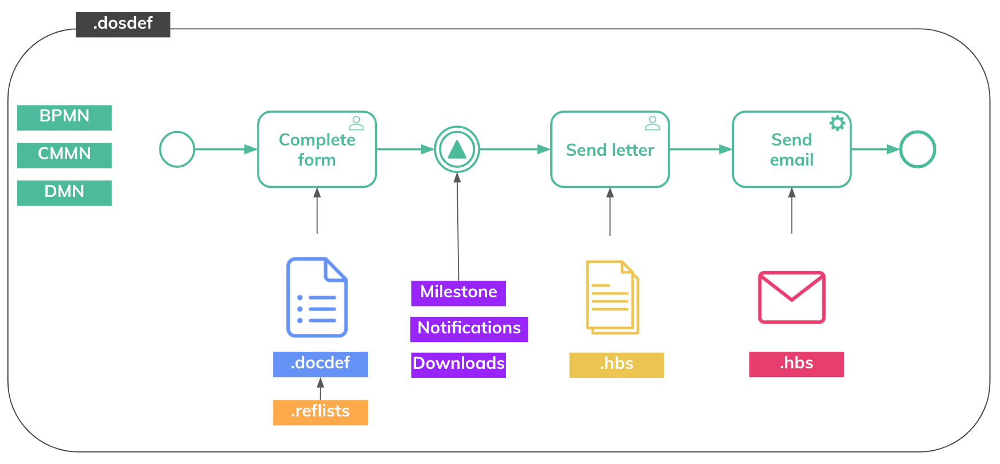

# Configuration Artefacts <!-- {docsify-ignore-all} -->

The core configuration concepts (artefacts) are shown in the image below.  It's everything a configurator needs to do to set up an application.

## Dossier (.dosdef)

The **dossier** is the top-level artefact, which bundles other artefacts such as a process in Camunda, a searchdef, a communication template, ... (cfr. overview slide).

Concrete examples of dossiers are:

* For WVL (Housing Flanders), we support different premium types. Every premium is a dossier type, e.g. renovation premium, adaptation premium.
* For VRF (Flemish Disaster Fund), we support one dossier type, i.e. "Claim Declarations in case of Natural Disasters"

In the dosdef file you define everything you need to be able to create a new dossier in the front-office or back-office. For example: what process will be started upon creation, etc.  

## Workflow (.bpmn, .cmmn, .dmn)

The Skryv platform integrates the Camunda workflow engine. This allows you to create executable processes, decision tables and cases. Typically we model one overarching process with multiple subprocesses. In the international standards (BPMN, CMMN and DMN) you define what will happen on the core modules. The engine makes sure the workflows are executable.

We typically start from one overarching BPMN flow that triggers other CMMN, DMN, docdefs, communication templates,..

## Information model (.docdef)

When you create a form for the front-office and/or back-office it is modeled in a docdef. In the docdef you define the different fields, the types, placeholders, validations, ... In our modules, the docdef is our information model.

In most cases we use the Skryv modeler to configure the docdef.

## Templates (.hbs)

Standard communication templates that we create via the handlebars technique. We personalise the communication templates with specific information on one's dossier. These templates can be used in communication tasks, e-mail communications etc...

## Search tables (.searchdef)

Searchdefs are typically used for bulk actions across multiple dossier instances. 

## Reference list (.reflist)

A list of all options that one can choose from. For example: a list of all vegetable types. Reference lists are used in the front-office and back-office module.

## Reports (kibana)

*Documentation will be added soon*