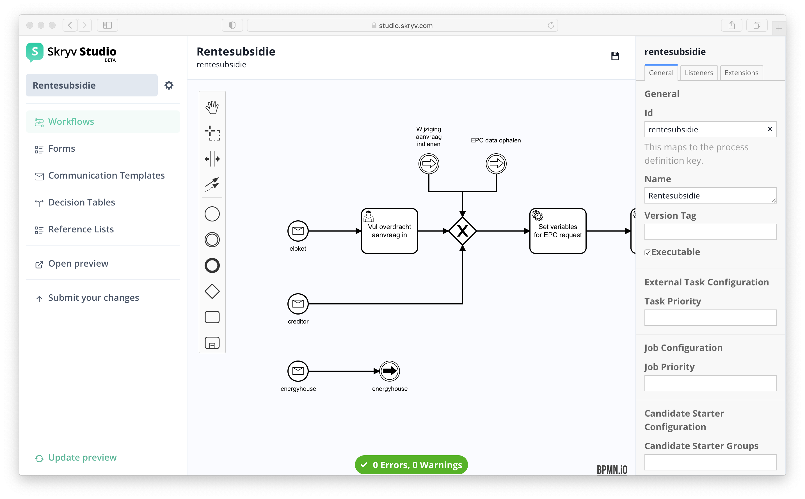

# Configuring Workflows

Workflows are a key concept in the transactional services that can be digitised on the Skryv Platform.
In the workflows section of Skryv Studio, you can configure the workflow and its corresponding logic.
The configuration is automatically turned into a working applications, including the user interface, persistence and search index.
## BPMN and DMN (and some CMMN)

The workflows are mainly configured in BPMN. Business Decisions are modelled in DMN. CMMN is supported for ad-hoc tasks.

For more information about the BPMN elements supported, please consult the [BPMN 2.0 Implementation Reference](https://docs.camunda.org/manual/7.14/reference/bpmn20/).
For more information about DMN and the supported features, please consult the [DMN 1.3 Implementation Reference](https://docs.camunda.org/manual/7.14/reference/dmn/).
For more information about the CMMN elements supported, please consult the [CMMN 1.1 Implementation Reference](https://docs.camunda.org/manual/7.14/reference/cmmn11/).
## Configuring tasks

BPMN support a number of tasks, such as user tasks and service tasks. 

To add a task to the workflow, execute the following steps in the workflow editor:

1. Drag the task icon to the workspace and release it on the place you
2. Click the task
3. Click the wrench
4. Select task type (eg. user task)

When the task is selected, the right information pane will give you access to the available configuration parameters of the task
## User task

User Tasks are tasks executed by users through the user interface.
The Skryv platform has out of the box support for various types of user tasks.

| Task type                  | Front-office | Back-office | 
|----------------------------|--------------|-------------|
| Yes/No task                | planned      | supported   |
| Form task                  | supported    | supported   |
| Communication task         | supported    | supported   |
| Ad-hoc tasks               | supported    | supported   |
| Advanced task types        | n/a          | supported   |

### Yes/No task

A Yes/No task is very simple type of task that allows the user to check off an action.
Simply Create a process or a case and add a user task to the latter. Use Workflow modeler to edit the workflow.

### Form task

A form task allows the user to enter and view  information inside a structured page. 

#### Instructions for configuration

1. Create a Form in the form editor
2. Create a process with a user task
3. Link the docdef to the user task:
   1. Select the task, this will show the details pane on the right
   2. Under `Element Template`, select Skryvdoc
   3. Add the id of the form as `Document Type`

?> There are a number of optional steps in the configuration

4. Choose the scope of the communication
   1. `Dossier` will link the form to the dossier, there can only be 1 form of this type in the entire dossier
   2. `Process` will link it to the process, so if the process is run multiple times inside the dossier (eg. monthly repeat) the form will be initialised for each process instance
   3. `Task` will link it to the task itself, so each time the task is executed, a new instance will be created.
5. Choose wether the form should become read-only after submitting
6. Choose wether the form should be valid before the task can be submitted (it is always possible to do intermediate saves)
7. Choose a custom Submit Button Label to shown on the button that completes the task.
8. Define the variable where you want to store the content of the form for later reuse

### Communication Task

A communication tasks allows the user to create a communication that will later be sent (e.g. via e-mail, eBox, ...) or printed.

#### Instructions for configuration

1. Create a new communication template in the [Communication Template Editor](/advanced_config/templates.md)
2. Create a process with a user task
3. Link the user task to the template:
   1. Select the task, this will show the details pane on the right
   2. Under `Element Template`, select SkryvCommunication
   3. Add the id of the template as `Template Name`

?> There are a number of optional steps in the configuration

4. Choose the scope of the communication
   1. `Dossier` will link the communication to the dossier, there can only be 1 communication of this type in the entire dossier
   2. `Process` will link it to the process, so if the process is run multiple times inside the dossier (eg. monthly repeat) the template will be initialised for each process instance
   3. `Task` will link it to the task itself, so each time the task is executed, a new instance will be created.
5. Choose wether the communication should be shown in read-only modus (eg. for printing)
6. Choose a custom Submit Button Label to shown on the button that completes the task.

### Form Tasks with Context

When executing a task in the back-office, it is often relevant for the dossier manager to have specific context to execute the task. Form tasks with context allow to cater for this need, by displaying the relevant context on the left side of the screen, and the form on the right side of the screen. It is possible to show other forms or uploaded files as context. Context can be opened or closed.

By default, all the forms in the dossier are shown as context (ordered alphabetically) for tasks in the back-office. No extra configuration is necessary.

Displaying uploaded attachments does require some configuration.

#### Instructions for configuration (attachments as context)

1. Take an existing form
2. Let the docdef you are using know where to find the context and content. You do this by adding computed expressions (under the logic tab of the form). 
   1. key: `cc_context_manipulator`, expression `$$.propertyManipulators.document_context`
   2. key: `cc_content_manipulator`, expression `$$`
   3. key: `cc_content_component`, expression `'component'`

!> Copy these expressions literally

To show attachments, add the following 2 steps:

3. Add a list to your form with the key `document_context` (the name of the field doesn't matter). Make sure the list visualisation is set to "Hidden" and the initial length is set to 0.
4. To show attachments, add a field attachment to this list with the key `context_file`(the name of the field doesn't matter).

Attachments can now be added as context to this form.

#### Adding Context Files automatically

This can be done in the workflow by chaining 2 service tasks:

1. Fetch the ID of the document to add with the following expression `${skryv.dossierFromScope(execution).getDocumentByDefinitionKey('yourFormKey').getField('yourAttachmentField').attachmentId}`
   1. Replace `yourFormKey` with the key of the form where the attachment was uploaded by the user
   2. Replace `yourAttachmentField` with the key of the attachment field in that form
   3. Assign the result of this service task to a Result Variable `attachmentId` 

2. Add the file to the context of a form with the following expression `${lbAttachmentService.setContextAttachment(execution, 'yourContextFormKey', 'attachmentId')}`
   1. Replace `yourContextFormKey` with the key of the form that needs to have the context
   2. Make sure that the 3rd parameter (`attachmentId` matches with the result variable name from step 3 above)

### Ad-hoc tasks

CMMN support allows you to add ad-hoc tasks, also referred to as actions, that depend on the 
For more information about the CMMN tasks, please contact [one of our consultants](mailto:support@skryv.com) to give you an introduction.

### Advanced task types

Besides the task types described above, we also support the following advanced task types:

- Form tasks with a list of sub-forms: This task type covers back-office tasks, which require the dossier manager to treat a list of items. This task type is especially useful in case the items in the list contain a lot of detail and each item requires a dedicated treatment from the dossier manager.
- Bulk tasks: This feature allows to execute tasks in bulk, e.g. approve decisions in bulk or print communication in bulk.

For these more advanced configurations, please contact [one of our consultants](mailto:support@skryv.com) to give you an introduction.

### Other configuration options for user tasks

#### Assignment

Automated assignment is a key feature for user tasks. Assignment can be configured in three ways:
- Assignee: A specific user can be set in the 'Assignee' field of a user task, making sure that this one, specific user will always be assigned to instances of this user task. This feature is typically only used to make sure that follow-up tasks are always assigned to a user that has previously executed specific tasks on the dossier.
- Candidate users: This is a list of possible assignees.
- Candidate groups: This is a group of assignees, which corresponds with the concept of a user role, e.g. 'casemanager' or 'validator'. Adding a candidate group ensure the task will get assigned to a user within the candidate group, i.e. with that specific role.

The image below shows a user task 'Controleer aanvraag', containing a candidate group 'dossierbehandelaar'. This ensure that only users with the role 'dossierbehandelaar' can get assigned to instances of the task 'Controleer aanvraag'. 

#### Due date

The image above shows that a due date can be set as well. The due date gives a deadline to the assigned user for the execution of the task. The due date can be set to an exact date, a duration (e.g. `P14D` for 14 days, as in the example above) or a relative date (e.g. request date + 14 days).

The due date is available in the dashboard and search pages, allowing the user to sort tasks by due date, ensuring the most urgent tasks are tackled first.

#### Asynchronous continuations

Asynchronous continuations can be used to optimise the UI response for the user.

Let's consider the example of a process with two user tasks and 20 automated tasks between these two user tasks.

By default, there are no asynchronous continuations, which means that the process engine will execute all the automated steps between the two user tasks in one go (one transaction). In this example, when a user submits the first task, this might lead to a long wait for the user to receive feedback from the application, because all automated steps need to be executed for the user to receive the feedback that the second user task is available.

To avoid this long wait for feedback, it is possible to check the box "Asynchronous After", e.g. on the first user task. This will result in immediate feedback to the user when the first task is submitted, and the automated tasks following the user task will then be executed in the background.

If it is however important for the user to see the second user task after submitting the first, there are two options:
- Do not use async checkboxes at your own risk. A long wait for the user without feedback will most likely result in a negative user experience.
- Use an async checkbox and add a customised spinner to show to the user that the application is processing, and add an automated refresh to display the second user task once it is available.

## Decision task

Decision tables (following the DMN standard) can be integrated into BPMN workflows to apply business rules.

Simply add a Business Rule Task in the BPMN workflow and follow these steps:
1. Link the DMN: With the Business Rule Task selected, go to the `General` tab of the information pane. In the section `Details`, select DMN as Implementation and fill out the Id of your DMN file in the Decision Ref field.
1. [OPT] Set the input variables: If all input variables to execute the DMN are already available on the process, this step can be skipped. If variables still need to be set, these can be added using Execution Listeners on start in the `Listeners` tab of the Business Rule Task.
1. Map the DMN output: In the General tab, under Result Variable, enter the name of the DMN output variable. The DMN output is now available and can be used further in the process.

## Service task

Service tasks allow to delegate specific functionality to pieces of code. 
The Skryv platform comes with a set of such predefined functionality (e.g. send a mail, send an update to Dosis, collect information from Magda, ...)

Through customisation of the app, new functionality can be added as well. Please contact [one of our consultants](mailto:support@skryv.com) to give you an introduction. 

## Expression Language (EL)

EL expressions can be used in many circumstances to evaluate small script-like expressions. 
As such, it allows to add more dynamic logic to the workflow, eg. to add a calculated due date, to calculate conditions etc.

A simple example is `${4 > 3}`:
* The `${ ... }` indicates this is an expression
* The expression itself `4 > 3`  will be executed
* The result will be `true`, which can be used in e.g. gateways.

A more useful example could be `${process-var == 'start'}`. This expression checks if a variable on the process called `process-var` is a `string` with the value `start`.
The **Fluent API** gives you access to a whole bunch of functionality that can be used in such expressions.  

The Unified Expression Language (EL) is specified as part of the JSP 2.1 standard ([JSR-245](https://jcp.org/aboutJava/communityprocess/final/jsr245/index.html)). 
The [JUEL](http://juel.sourceforge.net/) implementation backs the execution. 
To get more general information about the usage of Expression Language, please read the [official documentation](http://docs.oracle.com/javaee/5/tutorial/doc/bnahq.html). Especially the [provided examples](http://docs.oracle.com/javaee/5/tutorial/doc/bnahq.html#bnain) give a good overview of the syntax of expressions.
## Fluent API

Extending the EL expressions with Skryv specific support is realised through the Fluent API.

The Fluent API allows to interact with other configuration artefacts from a Camunda process. Examples when you want to use the fluent API is for example when you want to fetch the information a user filled in in the request to decide which path in the process you will follow.

The Fluent API is typically used in Camunda listeners or service tasks, to retrieve specific data from dossiers or to trigger specific operations on specific arterfacts from the Camunda process.

The base principle of the Fluent API is that you can chain one operation after the other, passing the output of the operation on the left to the next one. 

A simple example to explain this principle is `${skryv.dossierFromScope(execution).getLabel()}`, fetching the dossier label. This executes the following logic:
* `${...}` indicates this is an expression
* `skryv` creates the context of Skryv
* `.dossierFromScope(execution)` fetches the dossier
* `.getLabel()` returns the label

Another example is fetching the value from a field in a form: `${skryv.dossierFromScope(execution).getDocumentByDefinitionKey(‘formKey’).getField(‘pathToField’)}`

* `${...}` indicates this is an expression
* `skryv` creates the context of Skryv
* `.dossierFromScope(execution)` fetches the dossier
* `.getDocumentByDefinitionKey(‘formKey’)` fetches the form defined by `formKey` een specifiek formulier raadplegen
* `.getField(‘pathToField’)` fetches the value of the field with that path 

Finally, it is also possible to return true/false using comparisons, e.g. to decide which path in a gateway is to be followed. In the following case the expression will return `true` if the field value is larger than 10.
`${skryv.dossierFromScope(execution).getDocumentByDefinitionKey(‘formKey’).getField(‘pathToField’) > 10}`

The following sections contain the reference documentation for the Fluent API.

### Accessing a dossier

The most common need is to get full access to the current dossier:

`${skryv.dossierFromScope(execution)}`

Alternatively, a specific dossier can be retrieved based on its id, i.e. the business key:

`${skryv.dossier(dossierId)}`

### Operations on a dossier

#### Dossier label

To get the human readable dossier label:

`${skryv.dossierFromScope(execution).getLabel()}`

?> It is a best practice to store the dossier label in a Camunda variable `dossierLabel`. This makes it possible to retrieve dossiers in the Camunda cockpit based on the dossier id.

`${execution.setVariable('dossierLabel', skryv.dossierFromScope(execution).getLabel())}`

The dossier label can also be recalculated from the Camunda process, based on a specific label provider or not:

`${skryv.dossierFromScope(execution).recalculateLabel(labelProviderName)}`

`${skryv.dossierFromScope(execution).recalculateLabel()}`

?> It is a best practice to set the Camunda variable `dossierLabel` again whenever the dossier label is recalculated.

For more information on label providers, please refer to the article “[How to set up a label provider?](https://skryvdev.atlassian.net/wiki/spaces/SP/pages/1560543242)”.

#### Dossier export

`${skryv.dossierFromScope(execution).exportDossierWithAttachments(folderName)}`

`${skryv.dossierFromScope(execution).exportSkryvDossier(folderName)}`

#### Dossier access

`${skryv.dossierFromScope(execution).grantAccess().forTeamOfUser(userSub)}`

`${skryv.dossierFromScope(execution).revokeAccess().forTeamOfUser(userSub)}`

#### Generate a PDF from a template

`${skryv.dossierFromScope(execution).createCommunicationByTemplateName(String templateName)}`

Tip: use `${skryv.dossierFromScope(execution).createCommunicationByTemplateName(String templateName).getId()}` to retrieve the identifier of the generated PDF and add it as attachment to an e-mail.

#### Other dossier operations

`${skryv.dossierFromScope(execution).takeSnapshot(snapshotLabel)}`

`${skryv.dossierFromScope(execution).deactivate()}`

### Accessing a document

The most commonly used way to get access to a document on the current dossier is by using the getOrCreate method, which will create or - if it exists already - return the dossier scoped document for a specific definitionKey, i.e. docdef:

`${skryv.dossierFromScope(execution).getOrCreateDocumentByDefinitionKey(definitionKey)}`

Self-explanatory alternatives to retrieve a document are:

`${skryv.dossierFromScope(execution).getDocumentByDefinitionKey(definitionKey)}`

`${skryv.dossierFromScope(execution).findDocumentByDefinitionKey(definitionKey)}`

Accessing process scoped documents can be done as follows:

`${skryv.execution(execution).getOrCreateDocumentByDefinitionKey(definitionKey)}`

### Operations on a document

`getField(String fieldPath)`

`setField(String fieldPath, Object value)`

`markReadOnly()`

`markEditable()`

`reset()`

`isValid()`

`getDocument()`

`getRawDocumentValue()`

`getRawDocumentValueAs(Class<T> classOfT)`

`updateFromWorksheet(Map<String, Object> worksheetData)`

`updateFromVariableScope(VariableScope scope)`

`updateWithMapping(T input, MutableSkryvDocMapper<T> mapper)`

`clearAndUpdateWithMapping(T input, MutableSkryvDocMapper<T> mapper)`

### Accessing a process - delegateExecution

`skryv.execution(execution)`

### Accessing a communication

`skryv.communication(communicationId)`