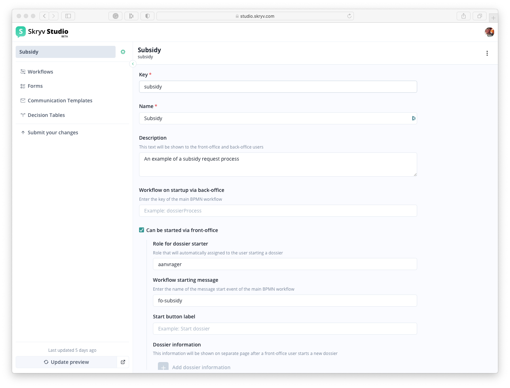
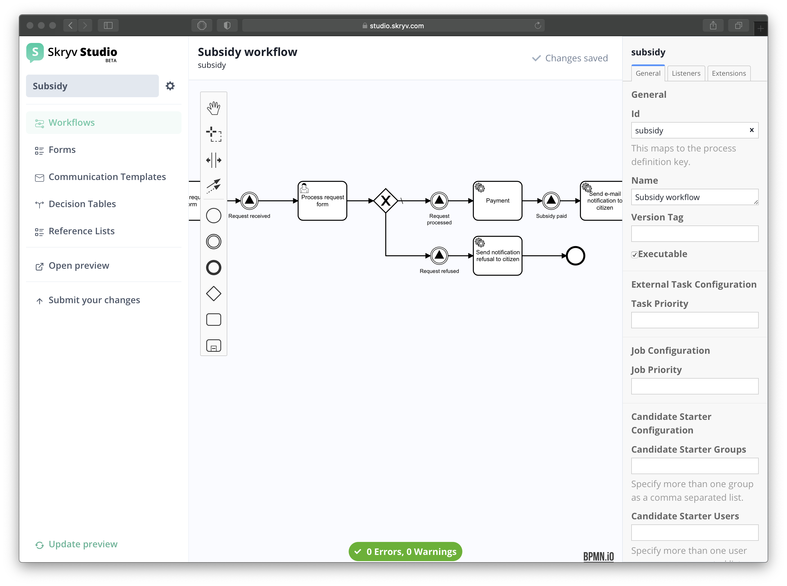

# Configuration guides

## Where to start with configuration

This guide gives you helpful tips and recommendations for configuring a working end-to-end process with Skryv Studio. We will give some advice on what you need to prepare before you start configuration, how to configure in an iterative way, and how test your application.

### 1. Prepare information about your process

Before getting started with configuration, you need to have some basic insight about the process you want to create and users that are involved. You can ask yourself the following questions:

- Who will have acces to the Front-Office?
- Who will have acces to the Back-Office?
- What is the starting point of the process?
- What is the end point of the process?
- Who needs to do what and when?
- What is are the minimal steps to go from start to end of the process in the best case scenario (= happy path)?
- What are the possible exceptions (= alternative paths)?
- What are the potential integrations with external services needed (i.e. authentication, payment platforms…)

_Example: Subsidy process_

_If we want to create a digital subsidy request process, here are some sample information we can collect before we start:_

- _Citizens will use the front-office_
- _Government workers will use the back-office_
- _The process starts when a citizen requests a subsidy via the front-office_
- _The process ends when the subsidy has been paid to the citizen_
- _The minimal happy path is that the citizen submits a request, a casemanager approves the request, and a payment is made_

### 2. Create your dossier type

Now that you have gathered all the information, it’s time to get started in Skryv Studio!

Start by creating a new dossier type for your process.

Clicking the gear icon next to the name you chose, takes you to the dossier settings.

More information about the dossier settings can be found in the [configuration reference documentation](/config-reference/dosdefs.md)

Within the dossier type, you can now start adding other configuration artefacts.

### 3. Create a first iteration of your process

Here the main principle is to work with small changes and to test often. After all, it is best to start with a small workflow that works as expected, than to immediately build something complex with errors that are hard to track down.

#### Create a basic workflow

The first version of your workflow should contain a minimal, high-level description of the happy path of your process. Feel free to use placeholders at this stage.

_In the example of a subsidy process, it can look something like this:_

- _Start event: a request is started in the front-office_
- _User task: a citizen fills the request form_
- _User task: a casemanager processes the request_
- _End event_

#### Create and link basic forms to the workflow

You can then create very simple versions of the forms that need to be linked to the user tasks.

For example: the first version of the subsidy request form contains only one section, a choice field, and a text field

Next, you can link the basic forms to your user tasks in the workflow. Check the guide to see how to do this.

#### Preview and test your configuration

The final and most important step is to preview you changes. Make sure you open the preview to the correct environment (front-office or back-office) and test whether your process is working as expected.

### 4. Build your process iteratively

Now that you have a first working version of your process, you can begin adding more details!

For the next iterations, we recommend to elaborate and refine the process in the following order:

- High-level end-to-end happy path
- High-level alternative paths
- Refinement of happy path (i.e. additional validations, business rules…)
- Refinement of alternative paths

All the information you have gathered in preparation will be useful as a guideline. It is best to continue configuration in small steps that are easy to test and to fix in case of errors. You can find more resources on how to refine and elaborate your process the way you want in the guides and reference documentation.

_In the example of the subsidy process, this way of working could look something like this:_

- _Add milestones and e-mail notifications to the citizens and casemanagers_
- _Add a XOR gateway in case the casemanager refuses the subsidy request_
- _Make some fields conditional in the request form (only shown when subsidy Type B), automatically calculate the value of the subsidy, refine e-mail templates…_
- _Add e-mail notifications to the citizen in case of refusal_

### 5. Validate your configuration

During the configuration iterations, it is very useful to have some the end-users test the application to be sure that all the steps in the process are clear. Some possible questions you can ask are:

- Is it clear how the fields in the forms need to be filled?
- Are the steps in a logical order? Can a user easily understand what is expected of them next?
- Is there enough transparency for the front-office user about the status of their dossier?
- …

Their input will make sure that the final result will be a successful digital service!

Feedback can then also be integrated in the configuration in the same iterative manner: by starting from the most impactful change and working down to the smaller improvements.

_For example, we can start by adding notifications so a citizen knows they have been approved or refused for their subsidy request, and then add help text to fields in the request form to help the citizen understand what they need to fill in._

## Configuration best practices

### Best practices for naming your configuration components

!> We highly recommend you to use a consistent convention to facilitate the configuration and maintainability of your process

- Define a clear name for your process (ex: childcare subsidy) that you can use when setting the key of configuration components. If necessary, use abbreviations but make sure they are easily understandable for yourself and for other potential configurators (ex: premium for the renovation or embellisment of house facades = reno facade premium).
- Set the key of your dossiertype to `myProcess` (example dossiertype key: childcareSubsidy).
- Set the key of your main workflow to `myProcess` (example workflow key: childcareSubsidy) and the key of your subprocesses to `subprocessMyProcess` (example subprocess key: appealChildcareSubsidy).
- To name forms, use a combination of the form's function and the name of your process: `formMyProcess` (examples of form keys: requestChildcareSubsidy, controlChildcareSubsidy, decisionChildcareSubsidy).
- To name templates, use a combination de type of document with the function and the name of your process: `typeTemplateMyProcess` (example template names: emailConfirmationChildcareSubsidy, letterDecisionChildcareSubsidy).

### Best practices workflows

- Give a clear name to your workflow and avoid any special characters.
- Name tasks in the `active verb + noun` format so it is clear what action is happening. For example, `Fill in request form` is better than `Request form` or `Filling in form`.
- Name the XOR and OR gateways in the `noun?` format so it is clear what information is relevant for selecting the pathways.
- Name the outgoing pathways from XOR and OR gateways with the condition.
- Always try to be as explicit as possible when configuring your workflow (add annotations when using listeners, use service tasks and message tasks when possible, ...).
- Only use CMMNs for simple extra actions that are outside of the main workflow.

### Best practices forms

- Avoid overloading a forms: use sections and fieldsets to keep a clear overview of the information.
- Use clear language in the labels, help text, notifications...
- Strive towards the Only-Once principle: only ask for information that is strictly necessary for the process.

### Best practices templates

### Best practices decision tables
