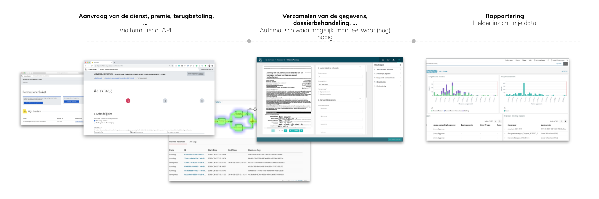

# Skryv Functionality

The Skryv platform is a low-code platform to set-up government services, from request to delivery.

To realise this, the platform comes with different modules, for which you can find more information in the following sections.

For specific government levels, we offer premade integration kits, including the housestyle, connectors to common systems and data sources, ... The VO Kit is such a kit for the Flemish Government. [Contact us](https://www.skryv.com/contact) for more information or if you want (to develop) your own kit.

## Front-office

## Back-office

## Automation

## Connector Factory

## Reporting

## VO Kit