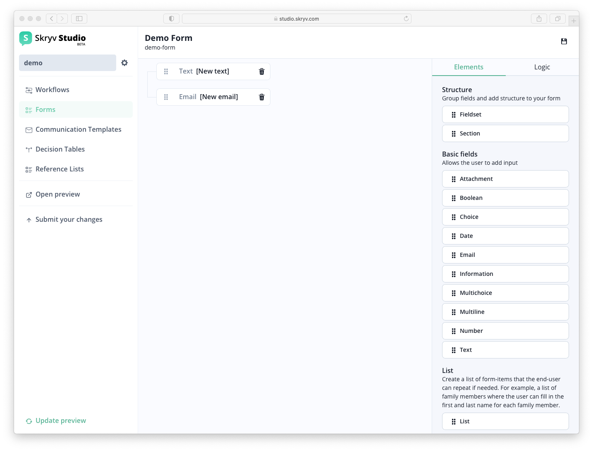
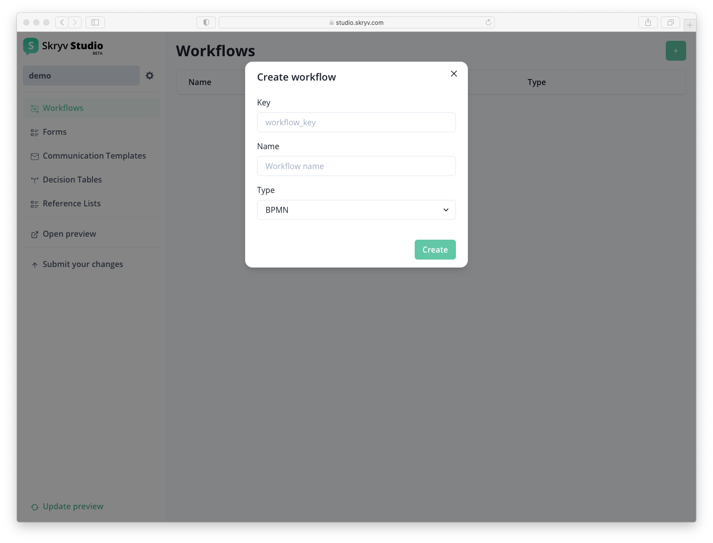
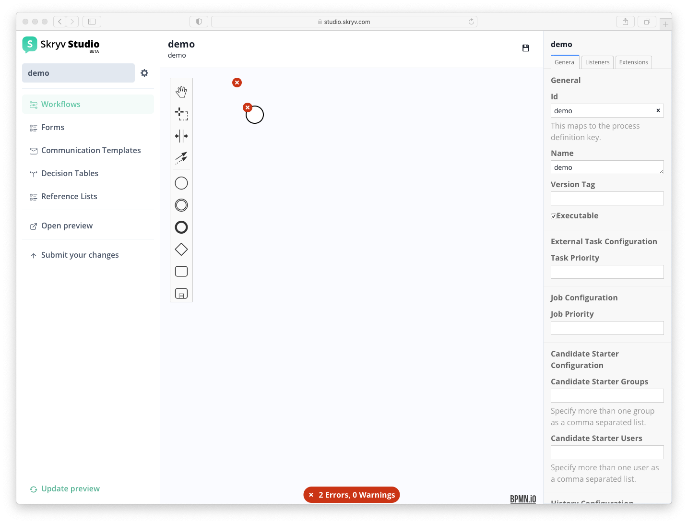
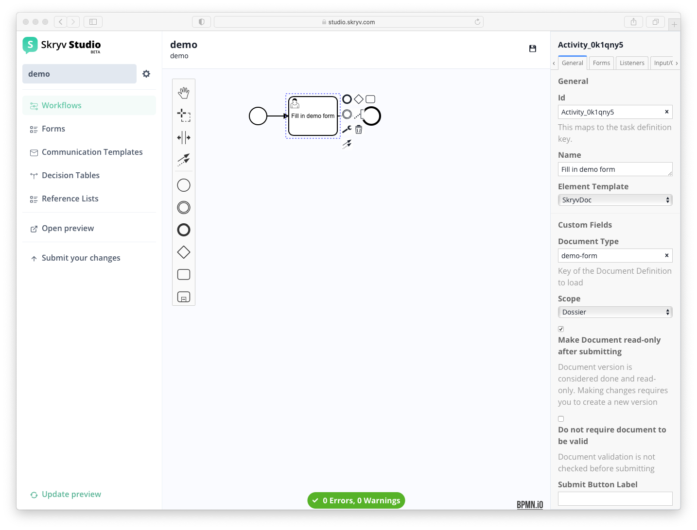
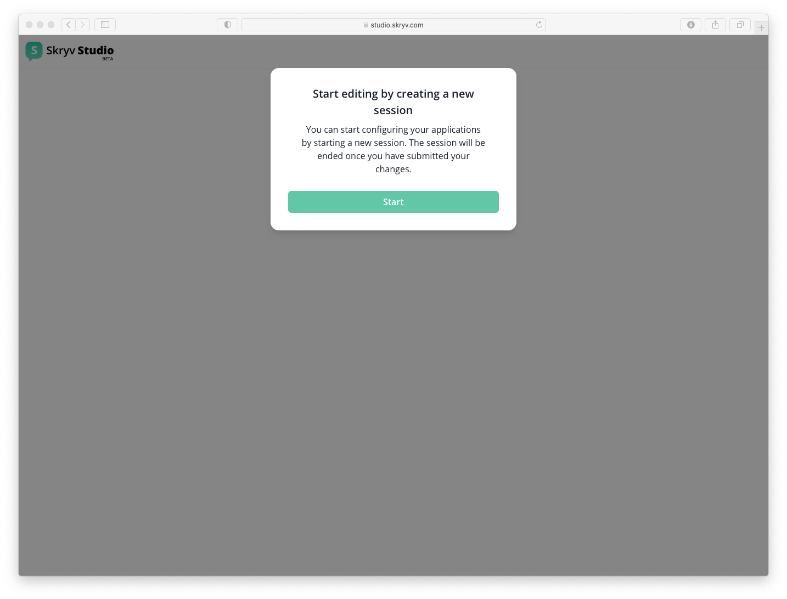

# Your 1st application

## Setting up your 1st dossier type

To create a new dossier type, simply click the `+` button on the application page in Skryv Studio.

Give your dossier type an identifier (key), name and description.

With this done, you can start configuring your forms and workflows!

## Setting up your 1st form

To add a form to your configuration, select `Forms` in the menu left and click the `+` button.

Give your form an identifier (key) and name.

This will bring you to the form modeler, which supports an extensive range of content types, validations and other behaviour.

Simply drag the fields and structural elements into the working zone, the blue area will indicate where the item will end up.

To add more detailed information, click on one of the items to take you to the properties.

?> For each of these fields, define at least the key

Once the form is ready, click the save button!

## Setting up your 1st workflow

To add a workflow to your configuration, select `Workflows` in the menu left and click the `+` button.

This will bring you to the workflow modeler, which supports an extensive set of BPMN elements.

As you start and as you continue, you will get indications of wether the BPMN is valid or not. Use the items on the left to create your workflow, for example the one shown below.
Use the wrench item to select the properties of the BPMN element. For a task that you want to link to a `Form`, the task type needs to be `User Task`.

Once you created this `User Task`, you can select an element template (right of the screen) and set this to `SkryvDoc` and put the name of the form you just created in the `Document Type`

With this done (and the save button clicked), you have a workflow with a task that is linked to the form!

## Preview your 1st application

## Publish your 1st version

Once you are happy with the changes you made, you can submit the changes.

This will trigger the quality assurance flow (including review and possibly testing of your configuration)

During this quality assurance flow, you will not see your changes anymore, once approved they become the new reality :)

