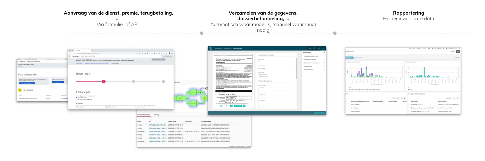

# Skryv Functionality

The Skryv platform is a low-code platform to set-up government services, from request to delivery.

To realise this, the platform comes with different modules, for which you can find more information in the following sections:

* [Front-office](front-office.md)
* Back-office
* Automation 
* Connectivity
* Reporting

For specific government levels, we offer premade integration kits, including the housestyle, connectors to common systems and data sources, ... [Contact us](https://www.skryv.com/contact) for more information

